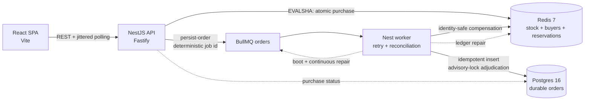

# Phase 6 — FROZEN CONTRACT (Ship)

**Authority:** architect (highest-capability / Opus-mapped)
**Date:** 2026-07-23
**Status:** FROZEN v1
**Base gate:** annotated tag `phase-5-done`, commit
`0f298b2bac1ec12a61ce4852c4915fc251ec5a05`
**Phase branch:** `phase-6/ship`, cut at merged `main`
`53fb7c268dde51d0572636649caed21d321ea2a6`
**Above this document:** `PRD.md` in full. **Also binding:** `AGENTS.md`,
`STATE.md`, and every frozen Phase 0–5 contract and amendment. The latest
numbered amendment always supersedes conflicting historical text.

This is the final evaluator handoff. It closes the README, verifies the actual
containerized system from a fresh clone, records independent security and
architecture sign-off, and performs the root-only Phase 6 gate. It does not
reopen product behavior or turn missing Phase 5 live evidence into a success
claim.

Once handed off, this contract is frozen. Ambiguity routes implementer →
orchestrator → architect. Any change to this contract is a numbered amendment,
never a side-channel convention.

---

## 0. Scope, inherited facts, and explicit resolutions

### 0.1 In scope

- Replace the bootstrap README with the complete take-home deliverable:
  - system design and actual enforcement points;
  - a Mermaid architecture diagram and a checked-in rendered SVG;
  - Docker and source-mode run instructions;
  - endpoint, port, configuration, verification, and troubleshooting guidance;
  - test strategy and exact stress-harness guide;
  - design decisions, alternatives rejected, accepted risks, and production
    hardening requirements;
  - truthful Phase 5 qualified limitation.
- Close the Phase 0 open risk that `.dockerignore` and the production image
  contents have never been proved from a cold clone.
- Repair the already-observable production-build seam:
  - all three dependency stages currently copy API and worker manifests, whose
    `workspace:*` graph requires `packages/redis/package.json`, but none copies
    that manifest;
  - `.dockerignore` does not currently exclude `.codex/` and still names obsolete
    Phase 0 load-result paths instead of the shipped `load/results/raw/` layout.
- Re-run the complete uncached repository gate, the Phase 4 browser gate, the
  Phase 5 factual-result integrity check, both Compose renders, production image
  content assertions, and a fresh-clone end-to-end purchase/persistence flow.
- Perform the mandatory Phase 6 security review and final architecture review.
- Complete the root-only `STATE.md`/commit/annotated-tag/push/PR/merge sequence,
  applying the owner-authorized GitHub Actions billing disposition exactly.

### 0.2 Out of scope

- Any edit under:

  ```text
  apps/**
  packages/**
  load/**                         # read and verify only
  prototype/**
  .github/workflows/**
  .agents/**
  .claude/agents/**
  .env.example
  package.json
  pnpm-lock.yaml
  pnpm-workspace.yaml
  turbo.json
  ```

- Any new dependency, environment variable, port, package, endpoint, DTO, Redis
  key/script, queue name/job shape, Postgres schema, retry rule, compensation
  rule, or browser behavior.
- Authentication, payments, multiple products/sales, cloud deployment, horizontal
  scaling implementation, or a production capacity claim; these remain PRD
  non-goals or documented production follow-ups.
- Running `pnpm stress`, `pnpm stress:smoke`, any k6 workload, or a replacement
  Phase 5 baseline on this delivery host. Phase 5 A13 retired the unrun baseline
  and forbids starting load that cannot publish a valid terminal audit.
- Weakening the root-owned, uid-0 `/usr/bin/ln` trust rule or representing the
  uid-65534 host as compliant.
- Editing, staging, deleting, moving, hashing into a deliverable, or otherwise
  touching `.codex/`. It is pre-existing untracked user state and must remain so.
- Modifying `STATE.md`, committing, tagging, pushing, opening/merging a PR, or
  changing Git metadata from an implementation or review slice. Those are root
  orchestrator actions only.

### 0.3 PRD and shipped-system resolutions that README must state

These are prior frozen design decisions, not Phase 6 behavior changes:

1. **I3 enforcement is inside `purchase.lua` using Redis `TIME`.** The PRD §2
   summary calls the API guard the primary enforcement point, but Phase 1
   deliberately strengthened this because an API-only check has a guard-to-Lua
   TOCTOU gap and pod-clock skew. The API guard is advisory fast rejection; the
   Lua half-open check is authoritative.
2. **Redis is its own `@flash/redis` package.** It is not inside
   `@flash/shared`; this keeps ioredis and real-Redis tests out of the browser
   graph.
3. **`@flash/shared` has `.` and `./schemas` entry points.** The web uses type-only
   DTO imports and local defensive decoders so Zod is not bundled.
4. **Worker terminal resolution is identity-safe and fail closed.** The shipped
   system uses reservation identity, Postgres advisory-lock adjudication, durable
   BullMQ failed work, identity-aware compensation, boot orphan recovery, and
   continuous reconciliation. README must not reduce I4 to “five retries then
   increment stock.”
5. **Phase 5 is qualified, not a passing benchmark.** The harness and fail-closed
   publisher passed substitute evidence, but the live workload, capacity/latency
   thresholds, tuning, and Phase 5 live I1–I4 audit were not run/evaluated.

### 0.4 Frozen public names

Phase 6 creates no shared runtime interface. Documentation consumes these existing
names exactly:

| Item | Frozen value |
| --- | --- |
| workspace packages | `@flash/api`, `@flash/worker`, `@flash/web`, `@flash/shared`, `@flash/redis`, `@flash/tooling`, `@flash/load` |
| API base | `http://localhost:3000/api` |
| web | `http://localhost:5173` |
| worker readiness | `http://localhost:3001/health/ready` |
| API routes | `GET /sale/status`, `GET /sale/metrics`, `POST /purchase`, `GET /purchase/:userId`, `GET /health`, `GET /health/ready` under `/api` |
| ordinary Compose file | `infra/docker-compose.yml` |
| stress Compose file | `load/docker-compose.yml` |
| ordinary named resources | `flash-net`, `flash-pgdata`, `flash-redisdata`, and containers `flash-{redis,postgres,api,worker,web}` |
| stress commands | `pnpm stress:smoke`, `pnpm stress`, `pnpm stress:audit` |
| result disposition | `load/results/phase-5-results.md` and `load/results/phase-5-results.sha256` |
| Node / pnpm | Node `>=22.14.0 <23`; pnpm `11.9.0` |

No Phase 6 writer may invent an alias or alternate spelling for one of these.

---

## 1. Hard invariants — Phase 6 obligations

Phase 6 changes no decision path. Its responsibility is to preserve the shipped
mechanisms, test them through the production stack, and describe them without
overclaiming.

| Invariant | Unchanged enforcement | Phase 6 proof and documentation obligation |
| --- | --- | --- |
| **I1 — no oversell** | Atomic Redis purchase Lua serializes duplicate check, stock check, decrement, buyer membership, and reservation-ledger write; identity-matching compensation is capped; worker never decrements stock. | README identifies Lua, not the UI/API/PG, as the purchase serialization point. The fresh-clone flow starts at stock 3, obtains exactly one confirmation for one user, rejects its duplicate, and observes stock exactly 2. The full real-Redis concurrency/negative-control suite remains green. |
| **I2 — one per user** | Redis buyer + reservation membership on the hot path and `orders_user_id_uniq` on `user_id` as independent durable defense. | README names both layers and the single-sale scope. Fresh-clone duplicate POST returns `409 ALREADY_PURCHASED`; status polling observes only the original reservation. Existing duplicate concurrency tests remain green. |
| **I3 — `[startsAt, endsAt)`** | Redis `TIME` inside `purchase.lua`; API guard and browser countdown are advisory. | README explicitly records the prior PRD refinement and exact half-open boundary. Fresh-clone proof generates an active server-side window and requires `active`; the existing exact-boundary and window-edge integration tests remain green. No Phase 5 live window result is claimed. |
| **I4 — no lost confirmations** | Redis reservation ledger + deterministic BullMQ handoff/reconciliation + idempotent reservation-identity PG insert + durable failed-set adjudication + identity-safe compensation. | README traces every confirmation to persisted or compensated terminal state and states the declared Redis-AOF durability boundary. Fresh-clone proof waits until the confirmed reservation is `persisted`; API and worker readiness remain healthy. Existing failure-mode integrations remain green. Phase 5 live I4 stays `NOT EVALUATED`. |

Container and documentation changes must not alter any enforcement point. A
security or final reviewer finding that an invariant mechanism changed is
critical and returns to the architect.

---

## 2. Exclusive path ownership and strict sequence

No two implementation slices own the same path. `+` creates and `~` modifies.

### S1 — production container build hygiene (`implementer`)

Mandatory skills, loaded in this order:

1. `.agents/skills/multi-stage-dockerfile/SKILL.md`
2. `.agents/skills/turborepo-monorepo/SKILL.md`

Exclusive paths:

```text
.dockerignore                  ~
infra/api.Dockerfile           ~
infra/worker.Dockerfile        ~
infra/web.Dockerfile           ~
```

No other path is owned by S1.

### S2 — evaluator documentation and diagram (`implementer`)

Mandatory skills, loaded in this order:

1. `.agents/skills/turborepo-monorepo/SKILL.md`
2. `.agents/skills/multi-stage-dockerfile/SKILL.md`
3. `.agents/skills/k6/SKILL.md`

Exclusive paths:

```text
README.md                      ~
docs/architecture.svg          +
```

No other path is owned by S2. The SVG is documentation, not a frontend asset; S2
must not edit `apps/web` or load it into the application.

### S3 — root-only ledger and publication

The root orchestrator exclusively owns:

```text
STATE.md                       ~
Git commits and annotated tag
branch/tag push
pull request creation/check inspection/merge
```

S3 is not an implementation agent. It may update `STATE.md` only after all
evidence and reviews in this contract are green.

### Read-only roles

- `security-reviewer` (highest-capability / Opus-mapped): no edits.
- final `architect` (highest-capability / Opus-mapped): no edits after contract
  freeze; returns review findings or sign-off.
- `adversarial-reviewer` (general-purpose / Sonnet-mapped) is dispatched only if
  S1 changes expand beyond the exact mechanical seam in §3 or a reviewer identifies
  a runtime-behavior finding. Pure documentation does not trigger this role per its
  roster definition.

### Sequence and freeze points

1. Architect freezes this contract.
2. S1 makes only §3's exact container-build changes and returns focused evidence.
3. S2 starts after S1 is present so its run instructions describe the actual final
   image/build behavior. It returns §6 evidence.
4. Root independently runs §7.
5. Root creates the candidate ship commit from explicit owned paths only.
6. Root runs the exact fresh-clone procedure in §8 against that candidate commit.
   Any failure returns only to the owning slice; a new candidate commit invalidates
   the old fresh-clone evidence and §8 runs again from the beginning.
7. Security reviewer performs §9 on the exact candidate digest.
8. Architect performs §10 on the exact candidate digest and the proposed
   `STATE.md` disclosure.
9. Root performs §11's state/tag/PR gate. No implementation agent performs any
   Git or external action.

S1 and S2 are deliberately sequential, not parallel. Reviews may run in parallel
only after the same candidate commit has passed §8.

---

## 3. S1 exact container-build contract

### 3.1 Docker dependency-stage workspace completeness

In each of:

```text
infra/api.Dockerfile
infra/worker.Dockerfile
infra/web.Dockerfile
```

add exactly this manifest copy beside the existing tooling/shared manifest copies
and before `pnpm install --frozen-lockfile`:

```dockerfile
COPY packages/redis/package.json packages/redis/package.json
```

Why it applies to all three: every current Dockerfile copies both API and worker
manifests before a full workspace install, and those manifests contain
`"@flash/redis": "workspace:*"`. A dependency stage that exposes the consumers but
not the workspace package has an incomplete graph. Do not replace this with a
registry version, `--no-frozen-lockfile`, root install fallback, copied host
`node_modules`, or a new install command.

No base image, pnpm version, deploy command, runtime user, healthcheck, build
command, `VITE_API_BASE_URL`, or final-stage file set changes.

### 3.2 `.dockerignore`

Preserve every current rule and make only these semantic corrections:

1. add `.codex/` under the “not needed inside any image” group;
2. replace obsolete load-result ignores:

   ```dockerignore
   load/k6/results/
   load/k6/*.summary.json
   k6-results.json
   k6-summary.json
   ```

   with:

   ```dockerignore
   load/results/raw/
   load/results/**/*.tmp
   ```

The tracked factual result and manifest remain eligible for the build context,
though no final runtime stage copies them. `.env.example` remains eligible;
`.env` and `.env.*.local` remain excluded. `.git/`, `.claude/`, `.agents/`,
`prototype/`, host dependencies, outputs, logs, and editor files remain excluded.

### 3.3 S1 forbidden work

- No Dockerfile stage restructuring, cache mount, dependency upgrade, `latest`
  tag, shell installer, new build argument, copied secret, or changed runtime
  command.
- No edit to either Compose file.
- No image build from the shared working tree. Focused S1 proof is static; root
  owns cold-clone Docker evidence in §8.
- No deletion or mutation of Docker containers, volumes, networks, or images.

### 3.4 S1 focused evidence

From repository root:

```bash
pnpm format:check
test "$(rg -l '^COPY packages/redis/package\\.json packages/redis/package\\.json$' infra/*.Dockerfile | wc -l)" -eq 3
rg -n "^\\.codex/$|^load/results/raw/$|^load/results/\\*\\*/\\*\\.tmp$" .dockerignore
test -z "$(rg -n 'load/k6/results|load/k6/\\*\\.summary|^k6-results\\.json$|^k6-summary\\.json$' .dockerignore || true)"
git diff --check -- .dockerignore infra/api.Dockerfile infra/worker.Dockerfile infra/web.Dockerfile
git diff --name-only -- .dockerignore infra/api.Dockerfile infra/worker.Dockerfile infra/web.Dockerfile
```

Required: all commands exit `0`, the manifest-copy count is exactly 3, and the
changed-path list is exactly the four S1 paths.

---

## 4. README content contract

S2 replaces bootstrap/status prose with an evaluator-facing document. It may
choose concise prose and heading wording, but it must contain all subsections and
facts below in this order. It must not copy whole frozen contracts into the README.

### 4.1 Title, summary, and evaluator map

- Title: `Bookipi Flash Sale System`.
- One-paragraph summary: single limited-stock sale, thousands of concurrent
  attempts, one unit per identifier, Redis-authoritative decision, async durable
  Postgres record.
- Repository link:
  `https://github.com/carlomigueldy/bookipi-technical-test`.
- A compact “what to review” map to architecture, run, tests, stress evidence,
  trade-offs, and limitations.
- State clearly that local Docker parity is the deliverable; no cloud deployment
  is claimed.

### 4.2 Architecture

Embed:

```markdown

```

Then include this Mermaid source semantically unchanged:



Immediately explain:

- API never writes Postgres on the purchase decision hot path.
- Redis makes the synchronous decision; Postgres is the durable record.
- BullMQ and reconciliation bridge the dual-write gap.
- compensation matches `reservationId`; stale failed work cannot tear down a
  later reservation.
- the declared durability boundary from Phase 3 §0.4: process/datastore partial
  failures are recovered while Redis/BullMQ durable state or Postgres survives;
  simultaneous irrecoverable destruction of every record of an unpersisted
  confirmation is outside what application code can recover without the rejected
  synchronous second durable write.

### 4.3 Invariants and enforcement table

Include all I1–I4 with their actual independent mechanisms from §1. For I3,
explicitly call the API guard and browser countdown advisory and Redis `TIME`
authoritative. For I4, describe re-enqueue, idempotent insert, durable failed work,
adjudication, and compensation; do not say “queue retry alone guarantees I4.”

### 4.4 Stack and repository layout

List all packages from §0.4 and distinguish:

- CommonJS Node packages/apps from the Vite ESM web;
- `@flash/shared` pure vs schema entry points;
- `@flash/redis` real-Redis atomicity surface;
- `load/` isolated harness and result disposition.

No stale statement may call `load/` a future phase or the web/API/worker a
scaffold.

### 4.5 Prerequisites and configuration

Exact prerequisites:

- Node in the root engine range (`22.14.x` recommended);
- pnpm `11.9.0`;
- Docker Engine/Desktop with Compose v2;
- `curl` for command-line smoke;
- Chromium only for the optional Playwright gate.

Link `.env.example` as the canonical environment contract. Explain:

- `.env` is untracked and must never be committed;
- the checked-in sample dates are illustrative and must be changed to a future or
  currently active window for an interactive purchase;
- production requires explicit `CORS_ORIGIN`, `DATABASE_URL`, `REDIS_URL`, and
  `SALE_ID`;
- Compose sets in-network Redis/Postgres URLs itself.

Do not add or document an environment variable absent from `.env.example`.

### 4.6 Run path A — complete Docker stack

Document:

```bash
cp .env.example .env
# Set SALE_STARTS_AT and SALE_ENDS_AT in .env to a current/future UTC window.
docker compose -f infra/docker-compose.yml up --build -d --wait
docker compose -f infra/docker-compose.yml ps
```

List web/API/worker URLs and all host ports. Include safe normal cleanup:

```bash
docker compose -f infra/docker-compose.yml down
```

State separately that `down -v` deletes the named local Redis/Postgres data and
must be used only when the operator intentionally wants a clean local sale. Never
present volume deletion as routine cleanup.

### 4.7 Run path B — source mode

Correct the bootstrap command that starts the entire Compose stack and then
collides with `pnpm dev`. The source-mode path is:

```bash
pnpm install --frozen-lockfile
cp .env.example .env
# Set an active/future sale window in .env.
docker compose -f infra/docker-compose.yml up -d redis postgres
while IFS='=' read -r key value; do
  case "$key" in ''|\#*) continue ;; esac
  export "$key=$value"
done < .env
pnpm dev
```

Explain that this starts only datastores in Compose; API, worker, and web run from
the workspace. API and worker read `process.env` and do not load the root `.env`
file themselves, so the quoted loop exports exact `key=value` rows while preserving
spaces in values such as `SALE_NAME`; do not replace it with unsafe
`export $(cat .env)`/`xargs` parsing. Vite may also consume its own supported
`VITE_*` value. Cleanup for this path is
`docker compose ... stop redis postgres` unless the operator explicitly wants to
remove persisted data.

### 4.8 Endpoint guide and smoke examples

List the exact routes in §0.4, their purpose, and principal response outcomes.
Provide shell examples for:

```bash
curl -fsS http://localhost:3000/api/sale/status
curl -fsS http://localhost:3000/api/health/ready
curl -i -X POST http://localhost:3000/api/purchase \
  -H 'content-type: application/json' \
  --data '{"userId":"reviewer-001"}'
curl -fsS http://localhost:3000/api/purchase/reviewer-001
```

State `userId` validation exactly: trimmed, 3–64 characters,
`[a-zA-Z0-9._@-]+`. Do not imply authentication or ownership proof.

### 4.9 Verification and testing

Canonical local gate:

```bash
pnpm install --frozen-lockfile
pnpm format:check
pnpm exec turbo run lint typecheck test build test:integration --force
pnpm --filter @flash/web test:e2e
pnpm audit --audit-level high
docker compose -f infra/docker-compose.yml config -q
PHASE5_K6_UID="$(id -u)" PHASE5_K6_GID="$(id -g)" \
  RAW_RESULT_DIR=/tmp/phase5-contract-results \
  docker compose -p flash-load-contract -f load/docker-compose.yml config -q
sha256sum -c load/results/phase-5-results.sha256
```

Explain unit, real-Redis atomicity plus negative control, real Redis/Postgres
integration, worker crash/retry/reconciliation tests, Playwright/axe/visual tests,
and k6 harness tests. `Cached: 0 cached` is required for gate evidence.

Do not claim fixed test totals as timeless instructions. Historical totals belong
in `STATE.md`.

### 4.10 Stress guide and qualified Phase 5 result

Document the isolated harness:

```bash
pnpm stress:smoke
pnpm stress
```

Explain:

- k6 is pinned as `grafana/k6:1.7.1`; no global install;
- the runner creates a validated `flash-load-<runId>` project with separate ports
  and disposable volumes, unique sales and buyers, and always-scoped cleanup;
- smoke is 30 seconds at 200 purchase attempts/s;
- full runs warmup plus surge, duplicate-storm, sold-out, and window-edge;
- target thresholds remain `http_req_failed < 1%`, purchase p95 `< 200 ms`,
  purchase p99 `< 500 ms`, and status p95 `< 50 ms` on a local-Docker baseline;
- target thresholds are acceptance criteria, not observed results on this host;
- terminal audit checks Redis, Postgres, queue/readiness, and I1–I4 before a run
  can pass;
- raw evidence is ignored under `load/results/raw/`; the tracked disposition and
  its checksum are linked.

Include this disclosure without softening any fact:

```text
Status: COMPLETE — OWNER-AUTHORIZED ENVIRONMENT-LIMITED EVIDENCE BYPASS
```

> Phase 5 live stress was not run on the delivery host. Secure atomic audit
> publication requires a root-owned, non-group/world-writable `/usr/bin/ln`; this
> host reports uid 65534. The owner authorized skipping privileged host
> remediation. The untuned baseline and final full stress were not run, tuning
> was not eligible, and performance/capacity plus Phase 5 live I1–I4 are not
> evaluated. On a compliant Linux host, run `pnpm stress`; do not bypass helper
> validation.

The README must not contain `thresholds met`, `no tuning required`, an achieved
rate/latency, `Phase 5 green`, or a Phase 5 live invariant `PASS`.

### 4.11 Design decisions and trade-offs

Use an ADR-style table with Decision / Alternative rejected / Why. At minimum:

1. Redis Lua vs distributed locks/Postgres hot-row locks.
2. Redis-authoritative decision + async BullMQ persistence vs synchronous
   Redis/Postgres dual write.
3. reservation-identity compensation and advisory-lock adjudication vs blind
   compensation.
4. Postgres unique constraint vs trusting Redis alone.
5. Redis `TIME` in Lua vs API-only window enforcement.
6. polling with jitter vs SSE/WebSockets.
7. NestJS on Fastify vs raw Fastify.
8. monorepo/shared contracts vs separate repositories.
9. real Redis negative controls vs `ioredis-mock`.
10. local Docker parity vs unrequested cloud deployment.

### 4.12 Security, accepted risks, and production follow-ups

Preserve and consolidate every current `STATE.md` accepted risk:

- client-asserted identity permits entitlement theft and buyer probing; production
  derives `userId` from an authenticated principal;
- readiness/metrics are public aggregate surfaces for the take-home and need an
  internal/authenticated production listener;
- Redis-backed rate limiting fails open by design and is not an invariant
  boundary; production needs edge/network flood protection;
- the single-sale global `orders_user_id_uniq` assumption requires a schema and
  contract migration for multi-sale;
- malformed internal queue data is retained and degrades readiness until
  operator repair;
- Node/pnpm pins are tight and Node runtime dependencies need a CommonJS
  `require` condition;
- the accepted frontend forced-refresh coalescing risk;
- GitHub Actions currently cannot execute because of account billing;
- Phase 5 live measurements remain unexecuted.

Also state: no secrets in Git, inputs are schema validated, SQL is parameterized,
Lua receives user data through `ARGV`, CORS is explicit in production, request
deadlines are bounded, and dependency audit is part of the gate.

### 4.13 CI and current delivery status

- Describe the maintained GitHub Actions graph: format/lint, typecheck, unit with
  Redis, build/artifact assertion, audit, integration with Redis/Postgres,
  Compose config, and diff-gated k6 smoke.
- State that Actions jobs currently abort before steps because of the
  owner-confirmed billing/spending-limit condition.
- State that this is an infrastructure/account limitation, not green CI and not a
  code failure; uncached local evidence is authoritative by owner decision.
- End with Phase 6 ship status and link `STATE.md`; remove the stale “Phase 0”
  status.

---

## 5. Rendered architecture SVG

`docs/architecture.svg` must:

- be a nonempty standalone SVG with `viewBox`, `<title>`, and `<desc>`;
- use only inline SVG/CSS; no script, animation, data URI, remote font, external
  URL, or `<foreignObject>`;
- be readable on light and dark GitHub canvases;
- contain the same modules and directed relationships as §4.2's Mermaid;
- distinguish synchronous purchase flow, async durability flow, read path, and
  reconciliation/compensation paths;
- label Redis authoritative and Postgres durable;
- include I1/I2/I3 at the Redis purchase seam and I2/I4 at the worker/PG seam;
- contain no benchmark number or Phase 5 pass claim.

The SVG is an accessible rendered companion, not the sole source: README includes
both the image and Mermaid.

---

## 6. S2 focused evidence

From repository root:

```bash
pnpm exec prettier --check README.md docs/architecture.svg
test -s README.md
test -s docs/architecture.svg
rg -n "Redis TIME|orders_user_id_uniq|reservationId|OWNER-AUTHORIZED|uid 65534|NOT RUN|NOT EVALUATED|pnpm stress:smoke|pnpm stress|Cached: 0 cached|GitHub Actions|billing" README.md
rg -n "Rendered flash-sale architecture|```mermaid|docs/architecture\\.svg|phase-5-results\\.md|phase-5-results\\.sha256" README.md
rg -n "<svg|viewBox=|<title>|<desc>|Redis|Postgres|BullMQ|reconciliation|compensation" docs/architecture.svg
test -z "$(rg -n "<script|foreignObject|https?://|data:|javascript:|@import" docs/architecture.svg || true)"
test -z "$(rg -ni "thresholds? met|no tuning required|Phase 5 green|live I1.?I4.*PASS|achieved [0-9]" README.md || true)"
test -z "$(rg -n "Phase 0 \\(bootstrap\\).*current|passes with no integration tests present|load/.*Phase 5\\)" README.md || true)"
sha256sum -c load/results/phase-5-results.sha256
git diff --check -- README.md docs/architecture.svg
git diff --name-only -- README.md docs/architecture.svg
```

Also run a relative-link checker over `README.md` and return its output. It must
resolve every local Markdown link against the repository root, including
`docs/architecture.svg`, `.env.example`, `STATE.md`, and both Phase 5 result
files. S2 may use an inline Node command; it must not add a script or dependency.

Required: all checks exit `0`; negative greps are empty; the changed-path list is
exactly S2's two paths.

---

## 7. Root independent repository gate

The root orchestrator reruns rather than trusts slice claims:

```bash
pnpm install --frozen-lockfile
pnpm format:check
pnpm exec turbo run lint typecheck test build test:integration --force
pnpm --filter @flash/web test:e2e
pnpm audit --audit-level high
node scripts/assert-build-output.mjs \
  apps/api/dist/main.js \
  apps/worker/dist/main.js \
  packages/shared/dist/index.js
test -s apps/web/dist/index.html
docker compose -f infra/docker-compose.yml config -q
PHASE5_K6_UID="$(id -u)" PHASE5_K6_GID="$(id -g)" \
  RAW_RESULT_DIR=/tmp/phase5-contract-results \
  docker compose -p flash-load-contract -f load/docker-compose.yml config -q
pnpm --filter @flash/load exec vitest run audit.spec.ts -t "A14"
sha256sum -c load/results/phase-5-results.sha256
test ! -e load/results/raw/baseline-20260723-a5
test -z "$(git ls-files .codex)"
test -z "$(git diff --name-only phase-5-done -- .codex)"
git diff --check
```

Required:

- frozen install unchanged;
- all Turbo tasks successful with `Cached: 0 cached`;
- no skipped datastore tests and no unhandled errors/warnings;
- browser tests pass in both projects with axe and visual comparisons;
- no high/critical advisory; `auditConfig.ignoreGhsas` remains empty;
- both Compose files render;
- A14 focused security tests pass;
- qualified result checksum is `OK`;
- retired baseline is absent;
- `.codex/` is untracked and untouched.

Do **not** run stress. A failure is fixed by the owning slice and the entire root
gate reruns; maximum three implement→verify iterations before architect
escalation.

---

## 8. Fresh-clone production run-through

### 8.1 Authority and safety preflight

This is root-orchestrator verification, not implementation. It may create and
remove only:

- one validated `/tmp/bookipi-phase6-fresh.*` directory;
- the ordinary Compose resources, but only after proving none existed before the
  run;
- one exact build-stage inspection image tagged
  `bookipi-phase6-context:<candidate12>`.

Before doing anything, require:

```bash
test "$(git branch --show-current)" = "phase-6/ship"
PHASE6_CANDIDATE="$(git rev-parse HEAD)"
PHASE6_CANDIDATE12="$(git rev-parse --short=12 HEAD)"
PHASE6_COMPOSE_PROJECT="phase6-fresh-${PHASE6_CANDIDATE12}"
test -n "$PHASE6_CANDIDATE"
test -n "$PHASE6_CANDIDATE12"
test "$PHASE6_COMPOSE_PROJECT" = "phase6-fresh-${PHASE6_CANDIDATE12}"
test -z "$(git status --porcelain --untracked-files=no)"
test -z "$(docker image ls -q "bookipi-phase6-context:${PHASE6_CANDIDATE12}")"
test -z "$(docker image ls -q "${PHASE6_COMPOSE_PROJECT}-api")"
test -z "$(docker image ls -q "${PHASE6_COMPOSE_PROJECT}-worker")"
test -z "$(docker image ls -q "${PHASE6_COMPOSE_PROJECT}-web")"
test -z "$(docker ps -aq --filter name='^/flash-redis$' --filter name='^/flash-postgres$' --filter name='^/flash-api$' --filter name='^/flash-worker$' --filter name='^/flash-web$')"
test -z "$(docker volume ls -q --filter name='^flash-pgdata$' --filter name='^flash-redisdata$')"
test -z "$(docker network ls -q --filter name='^flash-net$')"
```

Capture byte-sorted baseline lists of all container, network, and volume IDs before
the clone tests start. They are read-only provenance; cleanup must restore these
three lists exactly, proving Testcontainers and the production proof leaked no
resource while preserving unrelated pre-existing resources.

If any ordinary resource predates the proof, stop. Do not recreate, stop, rename,
inspect data from, or delete it. The owner/orchestrator must make those exact names
available by a separately authorized operation, then restart §8. This contract
does not authorize disruption of a developer stack.

### 8.2 Clone and clean-source proof

Create a unique temp directory with `mktemp -d
/tmp/bookipi-phase6-fresh.XXXXXX`, clone the local repository with
`--no-hardlinks`, detach at `PHASE6_CANDIDATE`, and require:

```bash
test "$(git rev-parse HEAD)" = "$PHASE6_CANDIDATE"
test -z "$(git status --porcelain)"
test ! -e .codex
test ! -e .env
```

Record `node --version`, `pnpm --version`, `docker --version`,
`docker compose version`, `git rev-parse HEAD`, and `git status --porcelain`.

Run from the clone:

```bash
pnpm install --frozen-lockfile
pnpm format:check
pnpm exec turbo run lint typecheck test build test:integration --force
pnpm --filter @flash/web test:e2e
pnpm audit --audit-level high
sha256sum -c load/results/phase-5-results.sha256
```

Required: the same §7 conditions and `Cached: 0 cached`.

### 8.3 `.dockerignore` and build-stage proof

Inside the temporary clone only, create four distinct sentinel files:

```text
.env
.codex/phase6-secret-sentinel
node_modules/phase6-host-sentinel
load/results/raw/phase6-raw-sentinel
```

Build the API `build` stage with the exact tag
`bookipi-phase6-context:<candidate12>`. Start a throwaway container from that
image with a shell entrypoint and require all of these to be absent:

```text
/app/.env
/app/.codex
/app/.git
/app/node_modules/phase6-host-sentinel
/app/load/results/raw/phase6-raw-sentinel
```

Also require:

```text
/app/packages/redis/package.json        exists
/app/apps/api/dist/main.js              exists and is nonempty
```

Remove the four sentinel files before starting Compose. Require
`git status --porcelain` empty again. The inspection image ID is recorded for
exact cleanup; it is never referenced by a glob.

### 8.4 Active sale and production stack

Generate:

- `SALE_ID=phase6-<candidate12>-<UTC YYYYMMDDhhmmss digits>`;
- `SALE_STARTS_AT` = current time minus 60 seconds;
- `SALE_ENDS_AT` = current time plus 15 minutes;
- `SALE_TOTAL_STOCK=3`.

Export only existing `.env.example` names. Bring up the shipped stack:

```bash
docker compose -p "$PHASE6_COMPOSE_PROJECT" -f infra/docker-compose.yml \
  up --build -d --wait --wait-timeout 180
docker compose -p "$PHASE6_COMPOSE_PROJECT" -f infra/docker-compose.yml ps
```

Do not create a repository `.env`. Wait is bounded at 180 seconds. Require all
five services healthy/running and these responses:

- web `/` → HTTP 200 and HTML containing the root mount;
- API `/api/health` → HTTP 200;
- API `/api/health/ready` → HTTP 200 with ready state;
- worker `/health/ready` → HTTP 200 with ready state;
- `/api/sale/status` → the generated `saleId`, `active`, total 3, remaining 3.

### 8.5 End-to-end invariant flow

Use the exact valid identifier `phase6-fresh-user`. Through real HTTP:

1. `POST /api/purchase` once; require HTTP 201, `CONFIRMED`, generated sale ID,
   user ID, and stock remaining 2.
2. Poll `GET /api/purchase/phase6-fresh-user` every 250 ms for at most 30 seconds.
   Require HTTP 200, `purchased: true`, the same sale/user, and terminal
   `order.status: persisted`.
3. POST the identical body again; require HTTP 409 and
   `ALREADY_PURCHASED`, never 201.
4. Read sale status again; require total 3, remaining exactly 2, and `active`.
5. Require API and worker readiness still HTTP 200.

Use `fetch`/JSON assertions in an inline Node module or `curl` plus inline Node
assertions. Do not add a tracked test file. Log response status and sanitized
business fields; do not log credentials or full environment.

This is a one-user production-stack smoke, not a load test or substitute Phase 5
live audit. Its evidence is I1–I4 end-to-end functional continuity for one
reservation only.

### 8.6 Runtime image-content proof

Record the exact API, worker, and web image IDs from the running Compose project.
Require:

- API and worker final images run as user `node`;
- API contains nonempty `/app/dist/main.js` and no `/app/src`, `.env`, `.git`,
  `.codex`, `prototype`, `load`, `PRD.md`, or `STATE.md`;
- worker has the same exclusions and nonempty `/app/dist/main.js`;
- web contains nonempty `/usr/share/nginx/html/index.html`, has no `.env`, `.git`,
  `.codex`, TypeScript source, source map, `prototype`, `PRD.md`, or `STATE.md`;
- no final image environment contains a secret value or a URL other than the
  frozen public build/runtime configuration;
- Docker history contains no sentinel text.

The build stage legitimately contains source and dependencies; the checks above
distinguish build-context exclusion (§8.3) from minimal final runtime contents.

### 8.7 Guaranteed cleanup

Cleanup runs from a `trap` on success, failure, or interruption. It validates the
temp path begins `/tmp/bookipi-phase6-fresh.` and the candidate/tag variables are
nonempty before mutation. Then:

1. `docker compose -p "$PHASE6_COMPOSE_PROJECT" -f
   infra/docker-compose.yml down --rmi local -v --remove-orphans`;
2. remove the exact recorded inspection image ID/tag, if it still exists;
3. remove only the validated temp clone directory;
4. verify no `flash-*` container, `flash-net`, `flash-pgdata`, or
   `flash-redisdata` remains;
5. compare byte-sorted container, network, and volume ID lists to the preflight
   snapshots and require exact equality;
6. verify no process serves ports 3000, 3001, 5173, 5433, or 6380 as a result of
   the proof;
7. verify the shared working tree still has only its pre-existing `.codex/`
   status plus intentional Phase 6 state.

No broad `docker system prune`, `docker volume prune`, image glob, broad process
kill, repository clean/reset, or deletion outside the exact temp path is allowed.
If cleanup fails, Phase 6 is not green even if all functional assertions passed.

### 8.8 Evidence record

Root records in `STATE.md`:

- exact candidate SHA and fresh-clone temp provenance (not the deleted path as a
  reusable artifact);
- version outputs;
- install/root gate/browser/audit/checksum summaries;
- image build and exclusion assertions;
- health/status/purchase/persisted/duplicate/stock assertions;
- cleanup assertions;
- zero claim that this was a load/capacity test.

---

## 9. Mandatory Phase 6 security review

Role: `security-reviewer`, highest-capability / Opus-mapped. It edits nothing.
Review the exact candidate commit after §8 and read `PRD.md`, `AGENTS.md`,
`STATE.md`, every latest amendment affecting security, the complete current HTTP
surface, CI, dependency manifests/lockfile, Dockerfiles/Compose, `.dockerignore`,
README, SVG, and Phase 5 disposition.

Run/inspect at minimum:

```bash
pnpm audit --audit-level high
git ls-files | rg '(^|/)\\.env($|\\.)|\\.pem$|\\.key$|id_rsa|credentials|secret'
rg -n "ignoreGhsas|TRUST_PROXY|REQUEST_BODY_LIMIT_BYTES|CORS_ORIGIN|RATE_LIMIT|STATEMENT_TIMEOUT|userId" pnpm-workspace.yaml .env.example apps/api apps/worker infra README.md
rg -n "dangerouslySetInnerHTML|child_process|exec\\(|spawn\\(|eval\\(|new Function|FLUSHDB|FLUSHALL|SMEMBERS|HGETALL|\\bKEYS\\b" apps packages load scripts
rg -n "<script|foreignObject|https?://|data:|javascript:|@import" docs/architecture.svg
git diff --name-only phase-5-done...HEAD
git diff phase-5-done...HEAD -- .dockerignore infra README.md docs/architecture.svg
```

Review conclusions must cover:

- server-side user validation and parameterized SQL/Lua `ARGV`;
- IP/user rate-limit bypass and documented fail-open boundary;
- proxy/CORS/headers/body/timeouts/error hygiene;
- unauthenticated entitlement theft and enumeration accurately disclosed;
- public readiness/metrics risk accurately disclosed;
- queue/reconciliation malformed-work behavior and no public mutation surface;
- dependency audit and empty suppression list;
- secrets/build-context/final-image exclusion;
- SVG active-content absence and Markdown links;
- no weakening of Phase 5 helper trust or fabrication of missing evidence;
- I1–I4 security angles.

Any open critical/high finding blocks the gate. A design finding returns to the
architect; an implementation finding returns to its exclusive owner. Required
approval wording:

```text
APPROVE — Phase 6 preserves the I1–I4 enforcement seams, ships no active-content
or secret-bearing artifact, accurately discloses unauthenticated/public surfaces
and both owner-authorized evidence limitations, and has no open high/critical
dependency or input-boundary finding.
```

---

## 10. Final architecture and deliverable review

Role: `architect`, highest-capability / Opus-mapped, read-only. Review the exact
candidate commit, §8 evidence, security result, and proposed `STATE.md` update.

Required checklist:

1. Every PRD §11 deliverable is present or accurately qualified:
   private repo, complete README, API, frontend, Mermaid + SVG, tests, k6 harness,
   audit, factual results.
2. README architecture matches the shipped code and latest frozen amendments,
   especially authoritative Redis `TIME`, reservation identity, worker
   adjudication, and reconciliation.
3. I1–I4 each name a concrete enforcement point and §8 evidence did not replace
   concurrency/failure tests with a happy-path smoke.
4. Docker/source-mode instructions do not create port collisions; dates are not
   silently stale; cleanup distinguishes persistent data.
5. Stress targets remain visible, but no target is represented as observed and
   every A13 limitation remains unsoftened.
6. CI billing bypass and host-security evidence bypass are separate, precise, and
   not called green.
7. Security/production limitations are concrete and actionable.
8. `.codex/`, `prototype/**`, application behavior, shared contracts, schema,
   queue, Lua, and dependency graph are untouched.
9. Fresh clone used a committed candidate, all images were built from it, the
   one-user reservation persisted, duplicate was rejected, stock stayed exact,
   and cleanup was complete.
10. `STATE.md` will close Phase 6 with exact evidence and no “next phase.”

Any inconsistency blocks the tag. Required approval wording:

```text
APPROVE — Phase 6 is evaluator-ready: the README and diagrams describe the
shipped interfaces and failure model, the committed candidate passed uncached and
fresh-clone production proofs with complete cleanup, Phase 5 remains truthfully
qualified, and no PRD deliverable or I1–I4 obligation is silently omitted.
```

---

## 11. Root-only final gate, tag, and pull request

### 11.1 Candidate commit

After §§3, 6, and 7 are green, root stages explicit paths only:

```text
.claude/contracts/phase-6.md
.dockerignore
infra/api.Dockerfile
infra/worker.Dockerfile
infra/web.Dockerfile
README.md
docs/architecture.svg
```

Never use `git add -A` while `.codex/` exists. Expected Conventional Commit:

```text
docs(ship): complete evaluator handoff
```

Fresh-clone evidence and both reviews bind to this candidate SHA. A later
implementation/doc change requires a new candidate commit and rerun from §7.

### 11.2 `STATE.md`

After §10 approval, root updates `STATE.md` to:

- `Phase 6 — Ship. CLOSED.` with annotated tag `phase-6-done`;
- current branch `phase-6/ship`;
- exact candidate and state commit identities;
- §7 uncached totals and browser/test/audit/checksum evidence;
- §8 fresh-clone versions, build/image-content, E2E reservation, duplicate,
  exact stock, and cleanup evidence;
- exact security and architecture approval wording;
- Phase 5 qualified status unchanged and clearly separated from Phase 6 smoke;
- GitHub Actions billing status unchanged unless live checks prove otherwise;
- open/accepted production risks retained;
- exact next action: none — PRD delivery complete; an optional compliant-host
  stress rerun requires a new architect-declared run ID and versioned result
  amendment.

Run:

```bash
pnpm exec prettier --check STATE.md README.md .claude/contracts/phase-6.md
sha256sum -c load/results/phase-5-results.sha256
git diff --check
test -z "$(git diff --name-only -- .codex)"
```

Root commits `STATE.md` explicitly with:

```text
docs(state): close Phase 6 ship gate
```

Then create exactly:

```bash
git tag -a phase-6-done -m "Phase 6: evaluator-ready flash sale delivery"
```

The tag points at the state-closing commit. Require `git cat-file -t
phase-6-done` = `tag` and `git rev-parse phase-6-done^{commit}` = `HEAD`.

### 11.3 Push, PR, CI billing handling, and merge

These authenticated external writes are root-only and are authorized by the
Phase 6 ship task:

1. push `phase-6/ship`;
2. push annotated `phase-6-done`;
3. open a PR to `main` with:
   - architecture/run/test/stress summary;
   - exact local uncached and fresh-clone evidence;
   - security and final architecture approvals;
   - explicit Phase 5 `NOT RUN / NOT EVALUATED` limitation;
   - explicit CI billing disposition;
4. inspect every check and its job/step execution, not only the aggregate color.

CI classification:

- If jobs abort before any step with the known account payment/spending-limit
  message, record `CI not run — owner-authorized billing bypass`; local uncached
  and fresh-clone gates remain authoritative.
- If any step starts and fails, it is a real failure until diagnosed. It may not
  be relabeled billing.
- Never write `CI green`, `checks passed`, or equivalent without an actually
  executed green run.

Merge only after the PR diff is exactly the Phase 6 owned paths plus `STATE.md`,
all local evidence/reviews remain bound to the merged tree, and no unresolved
review finding exists. After merge, require:

- PR state `MERGED`;
- `main` contains `phase-6-done^{commit}`;
- tag remains annotated;
- remote branch/tag resolve to the intended commits;
- no `.codex/` path exists in the PR or Git history.

The merge commit on `main` may differ from the tagged branch commit, matching
prior phase practice; its tree must contain the tagged commit unchanged.

---

## 12. ADR summary

| Decision | Alternative rejected | Why |
| --- | --- | --- |
| One container-hygiene slice before one documentation slice | parallel edits or doc-first prose | Documentation must describe the final build seam, and exclusive paths remain conflict-free. |
| Copy the missing Redis workspace manifest in every existing deps stage | registry fallback, unfrozen install, or Dockerfile redesign | Preserves the current workspace install/deploy strategy and makes every copied consumer graph complete. |
| Prove `.dockerignore` with sentinels in a disposable clone | inspect rules by eye only | A negative content assertion is falsifiable and closes the carried cold-clone risk without exposing user files. |
| Checked-in standalone SVG plus Mermaid source | Mermaid only or remote renderer | Satisfies the PRD rendered-image deliverable, remains reviewable/offline, and avoids a runtime/dependency/CDN addition. |
| Candidate commit before fresh-clone proof | clone a dirty/staged tree | A fresh clone must identify exact immutable source; later content changes invalidate evidence. |
| Preflight ordinary named Docker resources and fail on collision | recreate/stop a developer stack | The frozen Compose file uses explicit names; correctness proof never authorizes destruction of pre-existing state. |
| One-user E2E plus existing concurrency/failure suites | call the smoke a load test or rerun blocked stress | Proves reviewer quickstart continuity while preserving the truthful Phase 5 evidence boundary. |
| Two distinct owner-authorized limitations | combine CI billing and helper ownership as “environment issues” | One blocks remote CI execution; the other blocks live audited stress. Combining them obscures what was and was not proved. |
| Security review plus final architecture review | test output alone | Phase 6 must validate hostile-input/dependency surfaces and evaluator truthfulness, neither of which is proven by the code's own tests. |
| Local uncached gate when no Actions step executes | claim green CI or block forever | Matches the owner decision while retaining independently executed evidence and honest status. |

---

## 13. Copy-ready dispatch briefs

### S1

> **Role:** `implementer` (general-purpose / Sonnet-mapped implementation tier).
> Read `AGENTS.md` and `.claude/contracts/phase-6.md` in full. Load
> `multi-stage-dockerfile`, then `turborepo-monorepo`. Own only
> `.dockerignore`, `infra/api.Dockerfile`, `infra/worker.Dockerfile`, and
> `infra/web.Dockerfile`. Add the frozen Redis workspace manifest copy to every
> deps stage and correct only the frozen ignore rows in §3. Preserve all other
> stages/commands/versions. You are not alone in the repository: preserve all
> unrelated work and never touch `.codex/`. Run §3.4 and return actual
> output/status. Do not build images, run Docker mutation, edit application/docs/
> STATE/contracts, or perform Git/external actions.

### S2

> **Role:** `implementer` (general-purpose / Sonnet-mapped implementation tier).
> Start only after S1 is present. Read `AGENTS.md`, `PRD.md`, `STATE.md`, and
> `.claude/contracts/phase-6.md` in full. Load `turborepo-monorepo`,
> `multi-stage-dockerfile`, then `k6`. Own only `README.md` and the new
> `docs/architecture.svg`. Produce every §4 section and the safe standalone SVG
> in §5. The result must explain actual latest-amendment behavior, both run paths,
> exact stress targets, and the unsoftened Phase 5 `NOT RUN / NOT EVALUATED`
> disposition. You are not alone: preserve S1 and all unrelated work, never
> touch `.codex/`, application/load/prototype/STATE/contracts, dependencies, or
> Git. Run §6 with an inline relative-link check and return actual output/status.

### Security review

> **Role:** `security-reviewer` (highest-capability / Opus-mapped). Edit nothing.
> Read the exact candidate and execute `.claude/contracts/phase-6.md` §9 after
> fresh-clone proof is green. Attack input/rate-limit/DoS/error/dependency/
> secret/container/SVG surfaces and I1–I4. Verify both owner-authorized
> limitations are accurate and separate. Return the exact approval wording or
> ranked concrete findings.

### Final architecture review

> **Role:** `architect` (highest-capability / Opus-mapped). Edit nothing. Read the
> exact candidate, fresh-clone evidence, security result, README/SVG, all current
> frozen decisions, and proposed `STATE.md`. Execute §10. Return the exact
> approval wording or concrete contract/deliverable findings. Do not implement a
> fix, tag, push, or edit state.

---

## 14. Frozen decision index

1. Phase 6 has exactly two implementation slices: S1 container hygiene, then S2
   documentation.
2. No application, shared, load, CI, schema, queue, Redis, dependency, env, or
   port change.
3. `.codex/` is protected untracked user state and is excluded from build context,
   staging, PR, and history.
4. All three existing Docker deps stages copy
   `packages/redis/package.json`; no install/deploy redesign.
5. README includes both checked-in SVG and Mermaid.
6. README documents authoritative Redis-time window enforcement, not the obsolete
   API-only summary.
7. Docker-all and source-mode instructions are separate and do not bind the same
   ports twice.
8. Phase 5 targets are documented; live measurements and I1–I4 remain
   `NOT RUN / NOT EVALUATED`.
9. No stress workload runs on the delivery host in Phase 6.
10. Root uncached gate and production fresh-clone proof are both required.
11. Fresh-clone Docker proof fails rather than disturbing pre-existing ordinary
    resources.
12. One confirmed/persisted reservation plus duplicate rejection and exact stock
    is functional evidence, not load evidence.
13. Build-context sentinels and final-image exclusions close the carried
    `.dockerignore` risk.
14. Security and final architecture reviews are mandatory and read-only.
15. `STATE.md`, commits, annotated tag, push, PR, check classification, and merge
    are root-only.
16. GitHub Actions billing aborts count as `not run`, never green and never a code
    failure, only after confirming no step executed.
17. `phase-6-done` is annotated and points at the state-closing commit.
18. Terminal state is PRD delivery complete; there is no Phase 7.

---

## 15. AMENDMENT A1 — executable S2 SVG formatting and untracked-path evidence

**Authority:** architect (highest-capability / Opus-mapped)
**Date:** 2026-07-23
**Status:** FROZEN command-only correction
**Amends:** §6 S2 focused evidence only. S2 ownership, SVG content/security
requirements, README requirements, implementation, and every later root/review
gate remain unchanged.

### 15.1 Reproduced command contradictions

The frozen §6 command:

```bash
pnpm exec prettier --check README.md docs/architecture.svg
```

is not executable with the installed Prettier configuration because Prettier
infers Markdown for `README.md` but reports no inferred parser for the `.svg`
filename and exits `2`. The SVG is valid HTML/XML-family syntax and the installed
Prettier accepts it when the parser is explicit. Renaming the frozen
`docs/architecture.svg` path, changing Prettier configuration, adding a
dependency, or skipping formatting is unnecessary.

The frozen §6 command:

```bash
git diff --name-only -- README.md docs/architecture.svg
```

reports only tracked changes. A newly created, intentionally untracked
`docs/architecture.svg` is absent until staging, but S2 is forbidden from Git
actions. Requiring staging would violate role ownership; accepting an incomplete
path list would weaken exclusive-path evidence.

### 15.2 Exact corrected formatting commands

Replace only §6's first formatting command with:

```bash
pnpm exec prettier --check README.md
pnpm exec prettier --check docs/architecture.svg --parser html
```

Required: both commands exit `0`. The explicit `html` parser is formatting
selection only. It does not authorize HTML-only active content: §5 and §6's
negative SVG grep still forbid script, `foreignObject`, remote URLs, data URIs,
JavaScript URLs, and imports. All SVG accessibility and semantic requirements
remain binding.

### 15.3 Exact corrected changed-path evidence

Replace only §6's final changed-path command with:

```bash
test "$(
  {
    git diff --name-only -- README.md docs/architecture.svg
    git ls-files --others --exclude-standard -- README.md docs/architecture.svg
  } | LC_ALL=C sort -u
)" = "$(
  printf '%s\n' README.md docs/architecture.svg
)"
printf '%s\n' README.md docs/architecture.svg
```

This combines tracked working-tree changes with untracked, non-ignored owned
files, sorts/deduplicates deterministically, and requires exactly the two S2
paths. It performs no staging or mutation. An ignored/missing SVG, an extra owned
path, or a missing README change fails rather than disappearing from evidence.

S2 must still run the contract-wide ownership checks supplied by the
orchestrator/reviewers; this focused command proves only that S2's expected pair
is present without violating Git ownership.

### 15.4 Limited rerun rule

Only the corrected §15.2 and §15.3 commands need rerun when all of these are true:

1. every other §6 command already passed on the same `README.md` and
   `docs/architecture.svg` bytes;
2. neither S2 file changed after that evidence;
3. the only failures were the two reproduced command contradictions in §15.1;
4. no configuration, dependency, source, test, ownership, or security path
   changed.

If any premise is false, rerun all of §6, substituting §15.2 and §15.3 for the two
superseded commands. The root §7 gate, fresh-clone §8 proof, security §9 review,
architecture §10 review, and root §11 gate are never reduced.

### 15.5 Scope and invariant effect

- **Paths:** A1 authorizes an edit only to this contract. S2 still owns exactly
  `README.md` and `docs/architecture.svg`.
- **Security:** the active-content negative check is unchanged; explicit parser
  selection is not executable-content permission.
- **I1–I4:** no runtime or documentation meaning changes.
- **Git:** S2 remains forbidden to stage, commit, tag, push, or edit `STATE.md`.
- **Protected state:** `.codex/` remains untouched, untracked, and out of scope.
