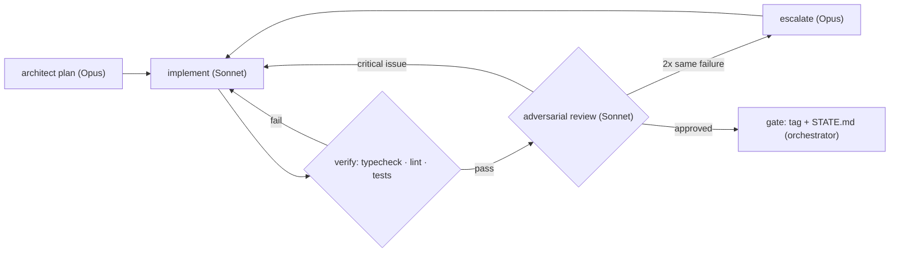

# AGENTS.md — Flash Sale System Build Rulebook

This file is the **runtime-agnostic contract** for building `bookipi-technical-test`.
It must let any agent runtime — Claude Code, Codex, or another — resume this build
**cold**, from the last git tag, with zero conversational context. If something here
conflicts with what an agent remembers being told in chat, this file wins.

Everything in this document is self-contained. Where a detail lives in another file
(the frozen contracts, `.env.example`, `STATE.md`), this file points at it rather
than duplicating it, so nothing here goes stale as phases complete.

---

## 1. What this repo is

`bookipi-technical-test` is a high-throughput **flash sale system**: a single
limited-stock product, thousands of concurrent buyers, one purchase attempt per
identifier, correctness enforced even under surge load and partial failure. It is
built as a pnpm + Turborepo monorepo (`apps/api` NestJS-on-Fastify, `apps/worker`
Nest standalone BullMQ consumer, `apps/web` Vite + React SPA, `packages/shared`
DTOs/types/state machine, `packages/tooling` lint/format/tsconfig presets), backed
by Redis 7 (authoritative hot path) and Postgres 16 (durable record).

**The authoritative spec is [`PRD.md`](./PRD.md).** Read it in full before making
any design decision this file doesn't already answer. This file operationalizes the
PRD's §8 (delivery plan) and §9 (agent harness) sections into an executable rulebook;
it does not restate the architecture, API spec, or testing strategy — those live in
the PRD.

---

## 2. Hard invariants I1–I4 — never negotiable

Quoted from PRD §2. Every phase gate, every review pass, every stress test exists to
prove these hold. An agent that ships code violating one of these has failed,
regardless of what else the diff accomplishes.

| #      | Invariant                                                                                                                                            | Why it matters                                                                                                                                                  | Primary enforcement                                                                                                                                                                                |
| ------ | ---------------------------------------------------------------------------------------------------------------------------------------------------- | --------------------------------------------------------------------------------------------------------------------------------------------------------------- | -------------------------------------------------------------------------------------------------------------------------------------------------------------------------------------------------- |
| **I1** | No oversell: confirmed orders ≤ initial stock                                                                                                        | The one correctness property a flash sale cannot fail at — overselling is a business incident, not a bug ticket                                                 | Redis Lua script (`SISMEMBER` → `GET`/check → `DECR` → `SADD`) executes as one atomic, single-threaded unit — no race window between checking stock and decrementing it                            |
| **I2** | One per user: at most one confirmed order per `user_id`                                                                                              | Fairness guarantee the brief requires; also bounds worst-case demand per user                                                                                   | Two independent layers: Redis `buyers` set (`SISMEMBER`/`SADD`, hot-path) **and** Postgres `orders_user_id_uniq` unique index on `user_id` alone (durable, survives a Redis bug or cold rebuild)   |
| **I3** | Window enforcement: no purchase outside `[startsAt, endsAt)`                                                                                         | A sale that accepts orders early or late isn't the sale that was advertised                                                                                     | API-layer sale window guard checks `now` against `startsAt`/`endsAt` **before** the Lua script ever runs — invalid-window requests never reach the atomic decision point                           |
| **I4** | No lost confirmations: every Redis-confirmed reservation eventually persists to Postgres or is compensated (stock returned) — never silently dropped | Redis being "authoritative" for the purchase decision only works if the durable record always eventually matches it; a silent gap here is worse than a slow one | BullMQ durable queue (`jobId = saleId:userId`) + idempotent worker insert (`ON CONFLICT (user_id) DO NOTHING`) with retry, and DLQ compensation (`INCR stock`, `SREM buyers`) on permanent failure |

Defense in depth is deliberate: I1/I2's hot-path enforcement (Redis) and durable
enforcement (Postgres) are independent mechanisms, not the same check twice.

---

## 3. Resume protocol

Follow this **exact numbered procedure** when starting cold — no memory of any prior
session assumed.

0. **Cold-start check.** Run `git tag --list 'phase-*-done' | sort -V`. If it is
   **empty AND `STATE.md` is absent**, no phase gate has ever closed — the build is
   mid-Phase-0. In that case: skip steps 1–4 below, read
   `.claude/contracts/phase-0.md` §19 (Definition of done) directly, treat the
   entire working tree as unverified in-progress Phase 0 work, and go straight to
   step 5 using `phase-0.md` as "the next contract." There is no earlier tag to
   check out and no `STATE.md` to read yet — both are Phase 0 deliverables
   themselves, not prerequisites for starting it.
1. Otherwise, `git tag --list 'phase-*-done' | sort -V` — enumerate completed phase
   gates.
2. Read `STATE.md` in full. **`STATE.md` is the single source of truth for "where
   are we"** — not this file, not commit messages, not chat history. It records the
   current phase, the last tag, verification evidence, open issues, and the exact
   next actions.
3. Decide whether to check out the latest tag — do **not** run `git checkout <tag>`
   unconditionally:
   1. `git status --porcelain` — if this is non-empty, **stop** and report rather
      than checking out anything; an agent must never discard a dirty working tree
      to reach a tag.
   2. `git log <latest-tag>..HEAD --oneline` — if this is non-empty, committed work
      already exists ahead of the tag. Treat that as **unverified in-progress work
      for the current phase**, stay on the current branch, and do **not** check out
      the tag (checking it out would hide that work, not just view history). Skip
      to step 4 on the current branch.
   3. Only if the working tree is clean and HEAD already equals the latest tag, or
      you deliberately need to inspect the last known-good state, run
      `git checkout <latest-tag-from-step-1>`. This lands on a detached HEAD by
      design — it is a read-only inspection point, not a place to commit. Before
      any implementation work, run
      `git checkout -b phase-<next>/<slice>` to create a real branch off it.
4. Re-run the gate's verification locally to confirm the tag (or current branch
   tip) is still good before building on it. This must match the CI job graph
   (`.github/workflows/ci.yml` / `.claude/contracts/phase-0.md` §17), not a weaker
   subset of it:
   ```bash
   pnpm install --frozen-lockfile
   pnpm format:check
   pnpm lint
   pnpm typecheck
   pnpm test
   pnpm build
   pnpm test:integration
   ```
   If this fails, the repo state has drifted from what the tag claims — stop and
   escalate rather than building further on a broken base.
5. Read `.claude/contracts/phase-<next>.md` for the next phase (where `<next>` is
   the phase number immediately after the one named by the latest tag, or `0` per
   step 0's cold-start case). This is the frozen, architect-authored spec for that
   phase's work — implement it exactly. If no contract file exists yet for the next
   phase, the orchestrator role (§5) must produce one before any implementation
   work starts.
6. Execute the **exact next actions** listed in `STATE.md`'s "Exact next actions"
   section — not a reinterpretation of them. (In the step-0 cold-start case, there
   is no `STATE.md` yet; the "exact next actions" are simply "implement
   `phase-0.md` and, on gate, write the first `STATE.md`.") If `STATE.md`'s next
   actions conflict with the phase contract, the phase contract wins on technical
   detail; flag the conflict back through the orchestrator rather than silently
   picking one.

---

## 4. Phase map & gates

| Phase                       | Scope                                                                                                     | Gate evidence                                           |
| --------------------------- | --------------------------------------------------------------------------------------------------------- | ------------------------------------------------------- |
| **0 — Bootstrap**           | Private GH repo, monorepo scaffold, tooling presets, docker-compose, CI skeleton, `AGENTS.md`, `STATE.md` | CI green on empty apps; `docker compose config` valid   |
| **1 — Domain core**         | `packages/shared`: state machine, DTOs; Redis service + Lua; unit tests                                   | Unit suite green incl. Lua atomicity specs              |
| **2 — API**                 | Sale + Purchase + Health modules, rate limiting, integration tests                                        | Integration suite green; concurrency spec passes        |
| **3 — Worker & durability** | BullMQ worker, idempotent persistence, DLQ compensation, reconciliation                                   | Failure-mode integration specs green                    |
| **4 — Frontend**            | React SPA from prototype reference (`frontend-design` skill mandatory)                                    | Visual parity w/ prototype; a11y checks; e2e smoke      |
| **5 — Stress & tuning**     | k6 scenarios, audit script, perf tuning, results writeup                                                  | Thresholds met; I1/I2 audit clean; results table        |
| **6 — Ship**                | README (design choices, diagram, run instructions, stress guide), final review pass                       | Fresh-clone run-through succeeds; final review sign-off |

**The gate ritual, every phase, no exceptions:**

1. Verification green — real command output (§8), never self-attestation.
2. `git commit` the phase's work.
3. `git tag -a phase-N-done -m "Phase N: <one-line summary>"` — **annotated** tags
   only (`-a`), never lightweight tags. The message is a one-line summary of what
   the phase shipped.
4. Update `STATE.md`: current phase, the new tag, verification evidence, open
   issues, and the exact next actions for the phase that follows.

A phase is not "done" until all four steps have happened. A green test run with no
tag and no `STATE.md` update is not a completed gate.

---

## 5. Orchestrator contract

The execution agent driving this build is the **root orchestrator**. It operates
under one absolute rule: **it never touches or writes source code** — no `Edit` or
`Write` on any file under `apps/`, `packages/`, `infra/`, `load/`, or any other
implementation path, ever. Its exclusive responsibilities:

1. **Plan and sequence phases** — maintain `STATE.md` and git tags as checkpoint
   bookkeeping only.
2. **Spawn subagents** with precise, self-contained briefs: exact files/paths owned,
   the relevant frozen contract, and explicit done-criteria.
3. **Run dynamic workflows** — compose plan → implement → verify → review loops per
   phase, re-planning when verification surfaces a critical issue rather than
   following a fixed script blindly.
4. **Arbitrate escalations** and enforce the model-routing policy (§6).

If the orchestrator finds itself about to edit a `.ts`/`.tsx`/`.sql`/`Dockerfile`
directly, that is a contract violation — it must spawn a subagent instead, even for
a one-line fix.

---

## 6. Model routing policy

Quoted from PRD §9.2. Every subagent invocation must respect this table; an agent
assigned a forbidden role for its model tier is a routing error, not a judgment call.

| Model               | Allowed roles                                                                                                      | Forbidden                                            |
| ------------------- | ------------------------------------------------------------------------------------------------------------------ | ---------------------------------------------------- |
| **Opus**            | Planning, architecture decisions, security review, failure-mode analysis, complex debugging, escalated code review | Mechanical sweeps (wasteful)                         |
| **Sonnet**          | All implementation (API, worker, frontend, tests, k6), adversarial code review loops                               | Final architecture sign-off on critical-path changes |
| **Haiku / Explore** | Codebase sweeps, file inventory, dependency audits, lint/format fixes, doc formatting, log triage                  | Any non-trivial logic                                |
| **Fable**           | **Implementation: NEVER.** Optional single final-review pass at Phase 6 only                                       | Everything else                                      |

**Runtime-mapping note (non-Claude-Code runtimes):** if resuming on Codex or another
agent runtime without named Anthropic models, map roles by capability tier, not by
model name: Opus ↦ the runtime's deep-reasoning / highest-capability mode, Sonnet ↦
the runtime's default general-purpose mode, Haiku/Explore ↦ the runtime's fast/cheap
mode for mechanical work. The role restrictions in the table still apply verbatim —
a "fast mode" agent still must not touch non-trivial logic regardless of what it's
called.

---

## 7. Subagent roster

Full definitions with system prompts live in `.claude/agents/*.md` (Claude-Code-
native format; see §13 for how another runtime should read them). Roles:

- **`architect`** (Opus) — phase plans, interface contracts, ADR notes. Produces the
  frozen `.claude/contracts/phase-N.md` that implementers build against.
- **`implementer`** (Sonnet) — backend/worker/test implementation against architect
  contracts.
- **`frontend-implementer`** (Sonnet) — builds the SPA against the prototype
  reference. **Hard rule: must load the `frontend-design` skill before writing any
  UI code.** This is non-negotiable per PRD §5 — an agent that starts writing
  components without having loaded it first is in violation regardless of the
  output quality.
- **`adversarial-reviewer`** (Sonnet) — reviews diffs with explicit intent to break
  I1–I4: races, window edges, retry storms, injection, resource leaks. Two
  consecutive failed loops on the _same_ issue escalate to Opus.
- **`security-reviewer`** (Opus) — Phase 2 & 6: input validation, rate-limit bypass,
  DoS surface, dependency audit.
- **`mechanic`** (Haiku) — mechanical sweeps only: lint autofixes, import ordering,
  dead-code removal, doc/README formatting. Never non-trivial logic.

**Mandatory skill provisioning.** Before spawning any implementation agent, the
orchestrator must identify and load the relevant technology skills for the slice
being implemented — this repo's project-local skills live at
`.claude/skills/` (symlinked from `.agents/skills/`) and currently cover:
`turborepo-monorepo`, `nestjs-best-practices`, `vite`, `vitest`,
`multi-stage-dockerfile`, `redis-core`, `redis-connections`, `redis-observability`,
`postgresql-table-design`, `bullmq-specialist`, `k6`, `vercel-react-best-practices`,
`frontend-design`. An implementation agent should load whichever of these its slice
touches (e.g. a worker-persistence slice loads `bullmq-specialist` +
`postgresql-table-design`; a Redis-hot-path slice loads `redis-core` +
`redis-connections`). **Frontend agents additionally always load
`frontend-design`** before touching UI code — see the hard rule above. It is
vendored project-locally (`.agents/skills/frontend-design/`, symlinked under
`.claude/skills/frontend-design`, tracked in `skills-lock.json`) precisely so this
rule is satisfiable from a fresh clone with no account-level state — a runtime
without a skill-loading mechanism should read
`.agents/skills/frontend-design/SKILL.md` directly instead. A brief handed to an
implementation agent without its skill manifest is invalid; the orchestrator must
re-issue it with the manifest attached rather than let the agent improvise
conventions it should have loaded.

---

## 8. Verification loop & loop budget

Every work unit (one implementer's slice, one reviewer's pass) runs this loop:



**Loop budget: maximum 3 implement→verify iterations per unit** before mandatory
escalation to Opus — this bounds token burn on stuck iterations rather than letting
an agent spiral. Two consecutive review failures on the _same_ underlying issue is
also an automatic escalation trigger, independent of the iteration count.

**Verification is command-evidence based, never self-attestation.** An agent
claiming "tests pass" without pasting the actual command output is not verification
— it is a claim, and claims don't gate anything. The canonical local verification
command block, run from repo root, matches the CI job graph in
`.github/workflows/ci.yml` / `.claude/contracts/phase-0.md` §17 — it is not a
weaker subset of it:

```bash
pnpm install --frozen-lockfile
pnpm format:check
pnpm lint
pnpm typecheck
pnpm test
pnpm build
pnpm test:integration
```

A check weaker than CI cannot confirm a tag or branch tip is still good — if this
block is green but CI later fails, the block was insufficient and must be fixed to
match CI, not the other way around. Phase-specific gates add to this (e.g. k6
thresholds in Phase 5, `pnpm stress`) — see each phase's contract in
`.claude/contracts/` for the phase-specific evidence required on top of this
baseline.

---

## 9. Fan-out rules

Within a phase, independent work units are dispatched as **parallel implementation
agents**, each owning a complete vertical slice with **exclusive path ownership** —
the orchestrator partitions the file tree so no two concurrent agents ever touch the
same package or path. This is conflict-free by construction, not by convention:

- Shared contracts (`packages/shared`, and the phase's frozen
  `.claude/contracts/phase-N.md`) are frozen by the architect **before** fan-out.
  Slices integrate only through those frozen contracts — never by reading each
  other's in-progress work.
- **Merge order is orchestrator-sequenced**, not simultaneous — later slices may
  reference earlier ones' frozen output paths/names, never their live diffs.
- **Any cross-slice change request routes back through the architect.** An
  implementer that needs something outside its owned paths never edits another
  slice's files directly and never asks another implementer agent-to-agent — it
  stops, reports the need, and the orchestrator re-engages the architect to update
  the frozen contract if warranted.
- A slice touching a path it does not own is a rejected diff, full stop — this holds
  even if the change is small, obviously correct, or would "save a round trip."

---

## 10. Conventions

- **Package scope:** `@flash` for every workspace package (`@flash/api`,
  `@flash/worker`, `@flash/web`, `@flash/shared`, `@flash/tooling`). Root package is
  unscoped (`bookipi-technical-test`). Internal dependencies are always
  `"workspace:*"` — never `"*"`, never a version range.
- **No path aliases, anywhere.** No `@/*`, no `~/*`, in any package. Cross-package
  imports use the package name (`@flash/shared`); intra-package imports are
  relative. This keeps Vitest/Vite/Nest/tsc resolution identical across every app.
- **Backend is CommonJS, web is ESM.** `apps/api`, `apps/worker`, `packages/shared`
  emit CommonJS (Nest + Fastify + `emitDecoratorMetadata` is the boring, fully-
  supported path). `apps/web` is ESM/bundler mode via Vite. `@flash/shared` being
  CJS means `apps/web`'s Vite config carries a `commonjsOptions` shim for it — this
  is expected, not a bug.
- **Environment variables:** the canonical name, type, default, and consumer for
  every env var lives in `.env.example` and the current phase contract's env table
  — this file does not duplicate it, since that table grows per phase. No env var
  exists under any spelling not present there.
- **Commits:** Conventional Commits — `feat|fix|chore|docs|test|ci|refactor(scope):
subject`. Scope is typically the slice or package touched (e.g.
  `feat(api): add purchase endpoint`).
- **Branches:** `phase-N/<slice>` (e.g. `phase-2/purchase-module`).
- **Never commit `.env`.** Only `.env.example` is tracked; `.gitignore` excludes
  `.env` and includes `.env.example`.
- **Never edit `prototype/`.** `prototype/index.html` is the approved, read-only
  reference implementation for the frontend — it is consulted, never modified.

---

## 11. Local dev quickstart

Prerequisites: **Node 22.11.x**, **pnpm 11.9.x** (both pinned — see `.nvmrc` /
`package.json#packageManager`). Docker Desktop with Compose v2 for the datastore
containers (note: in some environments Docker/WSL integration may be disabled — in
that case compose files are still authored and reviewed, just not executed locally;
check current environment notes before assuming `docker` is runnable).

```bash
pnpm i
docker compose -f infra/docker-compose.yml up -d
pnpm dev
```

`pnpm test`, `pnpm test:integration`, and `pnpm stress` run standalone once their
phases land (Phase 1+, Phase 2+, and Phase 5 respectively — earlier phases have
placeholder-safe versions that pass trivially).

**Ports** (no conflicts by design — host-side datastore ports are shifted off
defaults so a developer's local Postgres/Redis installs never collide):

| Service                                 | Container port | Host port (compose) |
| --------------------------------------- | -------------- | ------------------- |
| `api`                                   | 3000           | 3000                |
| `worker` (health only)                  | 3001           | 3001                |
| `web` (nginx in compose / vite locally) | 80             | 5173                |
| `postgres`                              | 5432           | 5433                |
| `redis`                                 | 6379           | 6380                |

In-network service URLs (inside compose) always use the **default** container ports
above, never the shifted host ports.

---

## 12. Definition of done per phase

- **Phase 0:** CI green on empty apps (lint, typecheck, unit, build, integration-
  with-no-tests, compose-config all pass); `docker compose config` valid.
- **Phase 1:** Unit suite green including Lua atomicity specs for the purchase
  decision script.
- **Phase 2:** Integration suite green; the concurrency spec (N=500 parallel
  purchases against stock=10 → exactly 10 CONFIRMED) passes.
- **Phase 3:** Failure-mode integration specs green — worker crash mid-job, DLQ
  compensation, boot reconciliation all proven under test.
- **Phase 4:** Visual parity with `prototype/index.html`; accessibility checks pass;
  end-to-end smoke green.
- **Phase 5:** k6 threshold checks pass (`http_req_failed < 1%`, p95/p99 latency
  targets per PRD §6.2); post-run I1/I2 audit against Postgres and Redis is clean;
  results table produced.
- **Phase 6:** A fresh clone can follow the README to a working system end to end;
  final review sign-off recorded.

---

## 13. Claude Code specifics (appendix)

Everything below is **Claude-Code-specific tooling** layered on top of the runtime-
agnostic rules above. Other agent runtimes (Codex, etc.) should ignore this section
entirely — it does not change any invariant, gate, or protocol described in §1–12.

- **`.claude/agents/*.md`** — the six roster definitions from §7, written as Claude
  Code subagent files (YAML frontmatter: `name`, `description`, `model`, `tools`,
  followed by a system prompt). Claude Code resolves these automatically when the
  orchestrator delegates work matching a role name.
- **`.claude/settings.json`** — project hooks (scripts in `.claude/hooks/`):
  a `PostToolUse` hook that typechecks the specific workspace package an edited
  `.ts`/`.tsx` file belongs to right after the edit, and a `PreToolUse` hook that
  blocks any `git push` whose target branch is `main`, forcing PR-based
  integration so CI is the gate that gets a green run before `main` moves. Purely a
  Claude-Code convenience layer over the same rules stated in §8 and §10; a runtime
  without hook support must enforce those rules by procedure instead.
- **Skills** — `.claude/skills/` (symlinked from `.agents/skills/`) holds the
  project-local skill set enumerated in §7. Claude Code's `Skill` tool loads these
  by name. A runtime without a skill-loading mechanism should read the referenced
  skill's guidance manually before implementing that slice.
