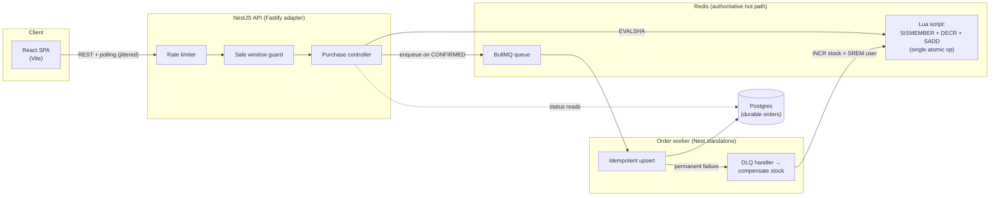
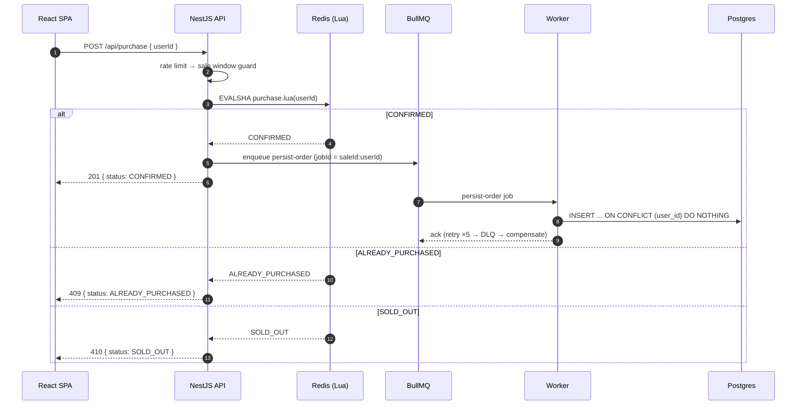
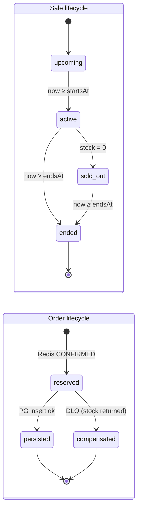
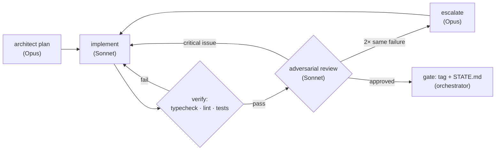

# PRD — High-Throughput Flash Sale System
**Repo:** `bookipi-technical-test` (private, GitHub) · **Author:** Miguel · **Date:** 2026-07-22 · **Status:** Draft v1

---

## 1. Overview

Build a simplified flash sale platform for a single limited-stock product, per the Bookipi take-home brief. Thousands of concurrent users attempt to buy one unit each during a configurable sale window. The system must stay correct (zero oversell, one item per user) and stable under surge load, with a React frontend, meaningful stress tests, and a clear architecture story.

This PRD is both the product spec and the **build contract for an agentic delivery pipeline**: a root orchestrator delegates all work to model-routed subagents through phase-gated, verification-looped workflows, with git-tagged checkpoints so progress can be resumed by a different agent runtime (Codex fallback) at any phase boundary.

### 1.1 Objectives

1. Demonstrate Staff-level system design: explicit invariants, defense-in-depth correctness, and articulated trade-offs.
2. Ship a runnable, testable monorepo in ≤ 7 days (target: sooner) with `docker compose up`-grade DX.
3. Prove behavior under load with reproducible k6 stress tests and post-run correctness audits.

### 1.2 Non-goals

- Payments, carts, multiple products, real auth (user identifier string only, per brief).
- Live cloud deployment (local Docker parity is the brief's stated bar).
- Horizontal autoscaling implementation (designed for, documented, not deployed).

---

## 2. Success criteria (evaluator lens)

| Brief criterion | How this design answers it |
|---|---|
| System design | Redis-authoritative hot path, async durable persistence, explicit failure/reconciliation model, clear diagrams |
| Code quality | NestJS modular architecture, shared typed contracts package, strict TS, lint/format CI |
| Correctness | Atomic Lua reservation + Postgres unique constraint (defense in depth); invariants asserted after stress runs |
| Testing | Unit + integration (Testcontainers) + k6 scenarios with thresholds and a SQL/Redis audit script |
| Pragmatism | Every major choice has a stated alternative and reason for rejection (§12) |

**Hard invariants (never violated, even under failure):**

- **I1 — No oversell:** confirmed orders ≤ initial stock.
- **I2 — One per user:** at most one confirmed order per `user_id`.
- **I3 — Window enforcement:** no purchase outside `[startsAt, endsAt)`.
- **I4 — No lost confirmations:** every Redis-confirmed reservation eventually persists to Postgres or is compensated (stock returned) — never silently dropped.

---

## 3. System architecture



**Design stance:** Redis is the *authority* for the purchase decision (atomicity at memory speed); Postgres is the *durable record* written asynchronously via BullMQ. The API never touches Postgres on the purchase hot path.

### 3.1 Component responsibilities

- **`apps/web` — Vite + React SPA.** Sale status view, identifier entry, Buy Now, result feedback, purchase-status check, compact ops panel. Short polling with jittered exponential backoff (2s base, ±30% jitter, capped 10s; tightens near sale start).
- **`apps/api` — NestJS on Fastify adapter.** Modules: `SaleModule` (status, config), `PurchaseModule` (attempt + status), `HealthModule`. Global `@fastify/rate-limit`, schema-validated DTOs from `packages/shared`, structured pino logs.
- **`apps/worker` — Nest standalone BullMQ consumer.** Drains `orders` queue, idempotent insert (`ON CONFLICT (user_id) DO NOTHING`), exponential retry (5 attempts), then DLQ → compensation (restore stock, remove user from buyers set) to uphold I4.
- **Redis 7.** Keys: `sale:{id}:stock` (int), `sale:{id}:buyers` (set), `sale:{id}:config` (hash). One Lua script = one atomic decision. AOF `everysec` in compose for restart durability; boot-time reconciliation rebuilds Redis from Postgres if keys are missing.
- **Postgres 16.** `orders(id uuid pk, user_id text unique, sale_id text, status text, created_at, persisted_at)` + `sales` config table. The unique index on `user_id` is the second, independent enforcement of I2.

### 3.2 The atomic decision (hot path core)

```lua
-- KEYS[1] = sale:{id}:stock   KEYS[2] = sale:{id}:buyers   ARGV[1] = userId
if redis.call('SISMEMBER', KEYS[2], ARGV[1]) == 1 then
  return 'ALREADY_PURCHASED'
end
local stock = tonumber(redis.call('GET', KEYS[1]) or '0')
if stock <= 0 then
  return 'SOLD_OUT'
end
redis.call('DECR', KEYS[1])
redis.call('SADD', KEYS[2], ARGV[1])
return 'CONFIRMED'
```

Single-threaded Redis execution makes check-decrement-record one indivisible unit — no race window between stock check and decrement, no distributed lock needed.

### 3.3 Purchase flow



### 3.4 Sale & order state



### 3.5 Failure modes & recovery

| Failure | Behavior | Invariant held |
|---|---|---|
| Worker crash mid-job | BullMQ redelivers; insert is idempotent (`jobId` + unique constraint) | I2, I4 |
| Postgres down | Reservations keep succeeding (Redis authoritative); queue buffers; worker retries with backoff | I1, I4 |
| Persistent insert failure | DLQ handler compensates: `INCR stock`, `SREM buyers`, mark order failed | I4 |
| Redis restart | AOF replay; if cold, boot reconciliation rebuilds stock/buyers from Postgres before accepting traffic | I1, I2 |
| API pod dies post-Lua, pre-enqueue | Startup sweep: diff Redis buyers set vs PG orders + queue; re-enqueue missing (rare, bounded, detectable) | I4 |
| Thundering herd at start | Rate limit (per-IP + per-user), Fastify backpressure, poll jitter prevents synchronized retry storms | stability |

---

## 4. API specification

Base: `/api`. All responses JSON with `serverTime` where relevant (client clock drift correction for countdown).

| Endpoint | Method | Purpose | Responses |
|---|---|---|---|
| `/sale/status` | GET | Sale state machine + window + stock remaining + serverTime | `200 { status: upcoming\|active\|sold_out\|ended, startsAt, endsAt, stockRemaining, serverTime }` |
| `/purchase` | POST | Attempt purchase `{ userId }` | `201 CONFIRMED` · `409 ALREADY_PURCHASED` · `410 SOLD_OUT` · `403 SALE_NOT_ACTIVE` · `422` invalid id · `429` rate-limited |
| `/purchase/:userId` | GET | Did this user secure an item? | `200 { purchased, order?: { status: reserved\|persisted, createdAt } }` |
| `/health` | GET | Liveness/readiness (Redis + PG ping) | `200 / 503` |

Validation: `userId` = trimmed, 3–64 chars, `[a-zA-Z0-9._@-]+` (email or username per brief). DTO schemas live in `packages/shared` and are consumed by both API (validation) and web (types) — one source of truth.

---

## 5. Frontend specification (`apps/web`)

**Visual direction: clean fintech** — light, trustworthy, precise. Near-white canvas, deep navy ink, single indigo accent, generous whitespace, tabular numerals for countdown and stock. No hype-drop theatrics; the design communicates *reliability under pressure*.

> **Binding rule:** every frontend implementation agent **must load the `frontend-design` skill before writing any UI code**. The approved high-fidelity prototype (`prototype/index.html`, Tailwind v4 CDN + shadcn/ui-style components + Motion CDN) is the **reference implementation** — the React build reproduces its layout, tokens, states, and motion.

### 5.1 Screens & states

- **Buyer card (primary):** sale status pill (upcoming / active / sold out / ended), countdown (to start when upcoming, to end when active), stock remaining meter, identifier input, Buy Now button.
- **Buy Now button states:** idle → loading → success (confirmed) / already purchased / sold out / ended / rate-limited — each with distinct, accessible feedback (not color-only).
- **Purchase check:** given an identifier, show reserved/persisted status.
- **Ops panel (compact strip):** stock gauge, sale window config, live status poll cadence, recent attempt outcomes counter (confirmed / duplicate / sold-out). Demonstrates observability thinking without scope creep.
- **Empty/error states:** API unreachable banner with retry; graceful degradation while polling.

### 5.2 Behavior

- Poll `/sale/status` with jittered backoff; tighten to 1s in the final 10s before start for a crisp countdown flip.
- Optimistic-safe: button disabled during in-flight attempt; server response is the only truth shown.
- Countdown computed against `serverTime` delta, not client clock.
- Accessibility: WCAG AA contrast, focus-visible rings, `aria-live="polite"` on status changes, `prefers-reduced-motion` respected.

---

## 6. Testing strategy

### 6.1 Unit & integration

- **Unit (Vitest):** sale state machine, Lua script logic (via ioredis-mock or embedded Redis), DTO validation, backoff/jitter utils, worker idempotency branch logic.
- **Integration (Vitest + Testcontainers):** real Redis + Postgres containers; full purchase flow; duplicate attempts; window edges (1ms before start / after end); worker retry → DLQ → compensation path; boot reconciliation.
- **Concurrency spec (the money test):** fire N=500 parallel purchases for stock=10 via `Promise.all` against the integration stack → assert exactly 10 CONFIRMED, 490 SOLD_OUT, PG rows = 10, distinct users = 10.

### 6.2 Stress tests (k6)

Scenarios in `load/k6/`:

1. **`surge.js`** — ramping-arrival-rate: 0 → 2,000 req/s over 30s, hold 60s; 50k unique user IDs; stock = 500.
2. **`duplicate-storm.js`** — 5k users each retrying 10× concurrently (tests I2 under contention).
3. **`window-edge.js`** — load starting 5s before `startsAt` (tests I3 + status flip under load).

Thresholds (fail the run if violated): `http_req_failed < 1%`, `p95 purchase < 200ms`, `p99 < 500ms` (local Docker baseline). After every run, `load/audit.ts` asserts I1/I2 against Postgres and Redis and prints a signed summary table for the README.

### 6.3 CI

GitHub Actions: lint → typecheck → unit → integration (service containers) → build. k6 smoke (30s, 200 rps) on PRs touching `apps/api` or `apps/worker`.

---

## 7. Monorepo layout (pnpm + Turborepo)

```
bookipi-technical-test/
├── apps/
│   ├── api/            # NestJS (Fastify adapter)
│   ├── worker/         # Nest standalone BullMQ consumer
│   └── web/            # Vite + React SPA
├── packages/
│   ├── shared/         # DTOs, types, sale state machine, constants
│   └── tooling/        # eslint, tsconfig, prettier presets
├── infra/
│   └── docker-compose.yml   # redis, postgres, api, worker, web
├── load/
│   ├── k6/             # surge.js, duplicate-storm.js, window-edge.js
│   └── audit.ts        # post-run invariant audit
├── prototype/          # approved high-fidelity HTML prototype (reference impl)
├── .claude/            # agent harness (see §9)
├── AGENTS.md           # rulebook — read by Claude Code AND Codex
├── STATE.md            # progress ledger (checkpoint/resume contract)
├── PRD.md              # this document
└── README.md           # deliverable per brief
```

DX bar: `pnpm i && docker compose up -d && pnpm dev` runs everything; `pnpm test`, `pnpm test:integration`, `pnpm stress` just work.

---

## 8. Delivery plan — phases, checkpoints, Codex fallback

Every phase ends at a **gate**: verification loop green → commit → **git tag `phase-N-done`** → **update `STATE.md`**. `STATE.md` records: phase completed, verification evidence (test/lint output summary), open issues, exact next actions. Because `AGENTS.md` + `STATE.md` + tags are runtime-agnostic, **Codex (or any agent) can resume from the last tag with zero conversational context** — this is the usage-limit fallback contract.

| Phase | Scope | Gate evidence |
|---|---|---|
| **0 — Bootstrap** | Private GH repo `bookipi-technical-test`, monorepo scaffold, tooling presets, docker-compose, CI skeleton, AGENTS.md, STATE.md | CI green on empty apps; compose up healthy |
| **1 — Domain core** | shared package: state machine, DTOs; Redis service + Lua; unit tests | Unit suite green incl. Lua atomicity specs |
| **2 — API** | Sale + Purchase + Health modules, rate limiting, integration tests | Integration suite green; concurrency spec passes |
| **3 — Worker & durability** | BullMQ worker, idempotent persistence, DLQ compensation, reconciliation | Failure-mode integration specs green |
| **4 — Frontend** | React SPA from prototype reference (frontend-design skill mandatory) | Visual parity w/ prototype; a11y checks; e2e smoke |
| **5 — Stress & tuning** | k6 scenarios, audit script, perf tuning, results writeup | Thresholds met; I1/I2 audit clean; results table |
| **6 — Ship** | README (design choices, diagram, run instructions, stress guide), final review pass | Fresh-clone run-through succeeds; final review sign-off |

Timeline intent: phases 0–2 day 1–2, phases 3–4 day 3–4, phases 5–6 day 5, buffer to day 7. Finish-ASAP bias: phases are sized for single-day agent runs.

---

## 9. Agent harness & orchestration strategy

### 9.1 Root orchestrator contract (ultracode)

The execution agent is the **root orchestrator**. It **NEVER touches or writes code** — no Edit/Write on source files, ever. It exclusively:

1. Plans and sequences phases; maintains `STATE.md` and git tags (checkpoint bookkeeping only).
2. Spawns subagents with precise, self-contained briefs (files, contracts, done-criteria).
3. Runs **dynamic workflows**: composes plan → implement → verify → review loops per phase, re-planning when verification surfaces critical issues rather than following a fixed script.
4. Arbitrates escalations and enforces the model-routing policy below.

### 9.2 Model routing policy

| Model | Allowed roles | Forbidden |
|---|---|---|
| **Opus** | Planning, architecture decisions, security review, failure-mode analysis, complex debugging, escalated code review | Mechanical sweeps (wasteful) |
| **Sonnet** | All implementation (API, worker, frontend, tests, k6), adversarial code review loops | Final architecture sign-off on critical-path changes |
| **Haiku / Explore** | Codebase sweeps, file inventory, dependency audits, lint/format fixes, doc formatting, log triage | Any non-trivial logic |
| **Fable** | **Implementation: NEVER.** Optional single final-review pass at Phase 6 only | Everything else |

### 9.3 Subagent roster (`.claude/agents/`)

- `architect` (Opus) — phase plans, interface contracts, ADR notes.
- `implementer` (Sonnet) — backend/worker/test implementation against architect contracts.
- `frontend-implementer` (Sonnet) — **must load `frontend-design` skill first** (hard rule in agent definition); builds SPA against prototype reference.
- `adversarial-reviewer` (Sonnet) — reviews diffs with intent to break I1–I4: races, window edges, retry storms, injection, resource leaks. Two consecutive failed loops on the same issue → **escalate to Opus**.
- `security-reviewer` (Opus) — Phase 2 & 6: input validation, rate-limit bypass, DoS surface, dependency audit.
- `mechanic` (Haiku) — mechanical sweeps: lint autofixes, import ordering, dead-code, README formatting.

### 9.4 Verification loop (per work unit)



Loop budget: max 3 implement-verify iterations per unit before mandatory escalation — prevents token-burn spirals (relevant to the 92% usage runway). Verification is command-evidence based (actual test output), never self-attestation.

### 9.5 Fan-out parallelization & skill provisioning

**Vertical-slice fan-out.** Within a phase, independent work units are dispatched as **parallel implementation agents**, each owning a complete vertical slice (e.g., sale status module, purchase module, worker persistence, a web feature) with **exclusive path ownership** — the orchestrator partitions the file tree so no two concurrent agents ever touch the same package/path. Conflict-free by construction: shared contracts (`packages/shared`) are frozen by the architect *before* fan-out; slices integrate only through those contracts. Merge order is orchestrator-sequenced; any cross-slice change request goes back through the architect, never agent-to-agent.

**Mandatory skill provisioning.** Before spawning any implementation agent, the orchestrator MUST run `find-skills` and load the relevant agent skills for the technologies that slice touches — **Redis, Postgres, NestJS, Docker, BullMQ, Turborepo, React, Vite** — so every agent starts with best-practice design patterns and conventions for that stack (clean, highly maintainable, robust code), rather than improvising them. Frontend agents additionally always load `frontend-design` (§5). An agent brief without its skill manifest is invalid; the orchestrator re-issues it.

### 9.6 Harness files

- **`AGENTS.md`** — rulebook readable by Claude Code *and* Codex: invariants I1–I4, routing table, orchestrator contract, phase gates, resume protocol ("read STATE.md → checkout last tag → continue next phase").
- **`.claude/agents/*.md`** — roster definitions above with model pins.
- **`.claude/settings.json` hooks** — post-edit typecheck hook; block direct pushes to `main` without green tests.
- **`STATE.md`** — the single resumable source of truth, updated only at gates by the orchestrator.

---

## 10. Non-functional requirements

- **Correctness:** I1–I4 absolute; proven by concurrency spec + post-stress audit.
- **Performance (local Docker baseline):** ≥ 2,000 purchase attempts/s sustained; p95 < 200ms, p99 < 500ms; status endpoint p95 < 50ms.
- **Resilience:** API stateless (horizontal-ready); worker at-least-once with idempotent writes; graceful shutdown drains in-flight jobs.
- **Observability:** structured pino logs with request IDs, attempt-outcome counters exposed on ops endpoint, BullMQ queue depth in health payload.
- **Security:** schema validation on all inputs, per-IP + per-user rate limits, no secrets in repo (.env.example), helmet-equivalent headers, dependency audit in CI.

---

## 11. Deliverables checklist (maps to brief)

- [ ] Private GitHub repo `bookipi-technical-test` (link shared with reviewers)
- [ ] README: design choices & trade-offs, system diagram, build/run instructions, stress-test guide + expected outcomes
- [ ] API server (NestJS/Fastify) with the three required endpoint groups
- [ ] React frontend with required buyer flow + feedback states
- [ ] System architecture diagram (mermaid in README + rendered image)
- [ ] Unit + integration tests; k6 stress tests + audit + results summary

---

## 12. Key trade-offs (interview defense)

| Decision | Alternative rejected | Why |
|---|---|---|
| Redis-authoritative sync decision | Fully-async 202 + poll | Instant UX and simpler client; queue depth no longer gates feedback; correctness identical (Lua is the serialization point) |
| Lua script atomicity | Distributed locks (Redlock) / DB row locks | One round-trip, no lock contention or lease-expiry edge cases; Postgres row locking collapses under 2k rps hot-row contention |
| Async persistence via BullMQ | Sync dual-write Redis+PG | Dual-write can't be atomic; async + idempotent replay + compensation is honest about distributed reality (I4) |
| Postgres unique constraint as second enforcement | Trust Redis alone | Defense in depth: even a Redis bug/rebuild can't create duplicate durable orders |
| Polling + jitter | SSE/WebSockets | 10s-scale freshness need; stateless API stays trivially scalable; jitter kills synchronized retry herds; less to break under surge |
| NestJS on Fastify adapter | Raw Fastify | Enterprise structure/DI/testing ergonomics at ~Fastify speed; matches a scale-up team's real codebase shape |
| Monorepo w/ shared contracts | Separate repos | Single source of truth for DTOs across api/worker/web; one CI; simpler for reviewers |
