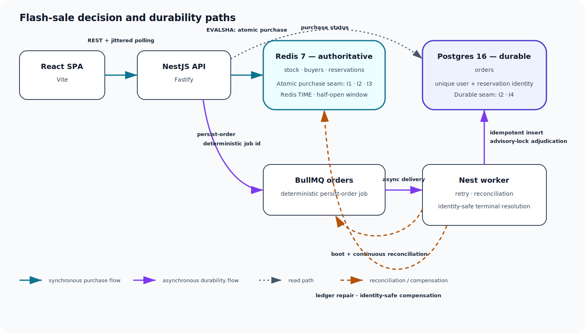
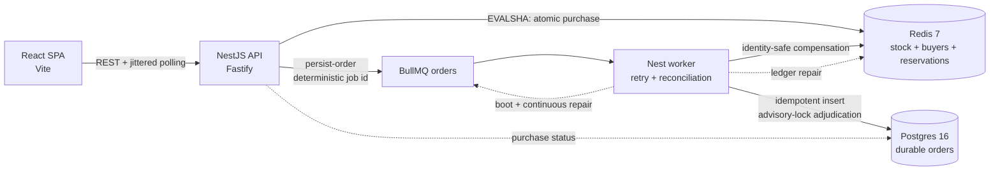

# Bookipi Flash Sale System

A high-throughput system for one limited-stock sale: thousands of concurrent
purchase attempts compete for one unit per identifier, Redis makes the
authoritative synchronous decision, and BullMQ asynchronously creates the durable
Postgres record.

Repository: <https://github.com/carlomigueldy/bookipi-technical-test>

Local Docker parity is the deliverable. This repository does not claim a cloud
deployment.

## What to review

| Area                         | Start here                                                                                                                              |
| ---------------------------- | --------------------------------------------------------------------------------------------------------------------------------------- |
| Architecture and correctness | [Architecture](#architecture) and [invariants](#invariants-and-enforcement)                                                             |
| Run the system               | [Complete Docker stack](#run-path-a-complete-docker-stack) or [source mode](#run-path-b-source-mode)                                    |
| Test strategy                | [Verification and testing](#verification-and-testing)                                                                                   |
| Load harness and evidence    | [Stress guide](#stress-guide-and-qualified-phase-5-result)                                                                              |
| Engineering choices          | [Design decisions and trade-offs](#design-decisions-and-trade-offs)                                                                     |
| Delivery limits              | [Security and accepted risks](#security-accepted-risks-and-production-follow-ups) and [current status](#ci-and-current-delivery-status) |

## Architecture





The API never writes Postgres on the purchase decision hot path. Redis makes the
synchronous decision; Postgres is the durable record. A deterministic BullMQ job
and the worker's boot and continuous reconciliation bridge the gap between those
two writes.

Terminal failure is not reduced to a blind stock increment. Compensation must match
the current `reservationId`, so stale failed work cannot tear down a later
reservation. The worker adjudicates conflicts under a Postgres advisory lock and
fails closed when it cannot prove a safe terminal action.

The declared durability boundary covers partial process or datastore failure while
Redis/BullMQ durable state or Postgres survives. Application code cannot recover
from simultaneous, irrecoverable destruction of every record of an unpersisted
confirmation without adding the deliberately rejected synchronous second durable
write.

## Invariants and enforcement

| Invariant                            | Enforcement                                                                                                                                                                                                                                                                                                                                                                                     |
| ------------------------------------ | ----------------------------------------------------------------------------------------------------------------------------------------------------------------------------------------------------------------------------------------------------------------------------------------------------------------------------------------------------------------------------------------------- |
| **I1 — no oversell**                 | `purchase.lua` atomically checks duplicate membership and stock, decrements stock, adds the buyer, and records the reservation. Redis serializes that decision. Identity-matching compensation is capped, and the worker never decrements stock.                                                                                                                                                |
| **I2 — one per user**                | Redis buyer and reservation membership reject duplicates on the hot path. Independently, Postgres index `orders_user_id_uniq` enforces one durable order per `user_id`. This implementation is intentionally single-sale.                                                                                                                                                                       |
| **I3 — window `[startsAt, endsAt)`** | Redis TIME inside `purchase.lua` is authoritative, including an inclusive start and exclusive end. The API guard and browser countdown are advisory fast feedback only; they are not the invariant boundary.                                                                                                                                                                                    |
| **I4 — no lost confirmations**       | The Redis reservation ledger and deterministic BullMQ handoff support re-enqueue. The worker performs a reservation-identity idempotent insert, retains durable failed work, adjudicates conflicts under an advisory lock, and either persists or performs identity-safe compensation. Boot orphan recovery and continuous reconciliation repair gaps; queue retry alone does not guarantee I4. |

## Stack and repository layout

The pnpm/Turborepo workspace uses strict TypeScript. `@flash/api`,
`@flash/worker`, `@flash/shared`, and `@flash/redis` emit CommonJS for Node; the
Vite web application is ESM.

| Workspace/path                        | Responsibility                                                                                                                                                          |
| ------------------------------------- | ----------------------------------------------------------------------------------------------------------------------------------------------------------------------- |
| `@flash/api` (`apps/api`)             | NestJS on Fastify: sale, purchase, health, rate limiting, and status reads                                                                                              |
| `@flash/worker` (`apps/worker`)       | Nest standalone BullMQ consumer: persistence, terminal adjudication, compensation, and reconciliation                                                                   |
| `@flash/web` (`apps/web`)             | Vite + React buyer and operations SPA                                                                                                                                   |
| `@flash/shared` (`packages/shared`)   | Pure DTO/types/state entry point `.` and server-only Zod entry point `./schemas`; the web uses type-only DTO imports and defensive local decoders so Zod is not bundled |
| `@flash/redis` (`packages/redis`)     | Redis clients, Lua scripts, reservation ledger, and real-Redis atomicity tests, isolated from the browser graph                                                         |
| `@flash/tooling` (`packages/tooling`) | Shared ESLint, Prettier, and TypeScript configuration                                                                                                                   |
| `@flash/load` (`load/`)               | Isolated k6 runner, invariant audit, harness tests, ignored raw output, and tracked result disposition                                                                  |
| `infra/`                              | Production-style Dockerfiles, Postgres initialization, and the ordinary Compose stack                                                                                   |

The tracked stress disposition is in
[`load/results/phase-5-results.md`](./load/results/phase-5-results.md), with its
integrity manifest in
[`load/results/phase-5-results.sha256`](./load/results/phase-5-results.sha256).

## Prerequisites and configuration

- Node `>=22.14.0 <23` (`22.14.x` recommended)
- pnpm `11.9.0`
- Docker Engine or Docker Desktop with Compose v2
- `curl` for command-line smoke checks
- Chromium only for the optional Playwright browser gate

Use [`.env.example`](./.env.example) as the canonical environment contract. Copy
it to the untracked `.env` file and never commit that file. Its checked-in sale
dates are illustrative; set a future or currently active UTC window before an
interactive purchase.

Production requires explicit `CORS_ORIGIN`, `DATABASE_URL`, `REDIS_URL`, and
`SALE_ID`. Compose supplies its own in-network Redis and Postgres URLs. Do not use
the host-side `5433` and `6380` ports from inside Compose.

## Run path A: complete Docker stack

```bash
cp .env.example .env
# Set SALE_STARTS_AT and SALE_ENDS_AT in .env to a current/future UTC window.
docker compose -f infra/docker-compose.yml up --build -d --wait
docker compose -f infra/docker-compose.yml ps
```

The running surfaces are:

| Service          | URL                                  | Host → container port |
| ---------------- | ------------------------------------ | --------------------- |
| Web              | <http://localhost:5173>              | `5173 → 80`           |
| API              | <http://localhost:3000/api>          | `3000 → 3000`         |
| Worker readiness | <http://localhost:3001/health/ready> | `3001 → 3001`         |
| Postgres         | `localhost:5433`                     | `5433 → 5432`         |
| Redis            | `localhost:6380`                     | `6380 → 6379`         |

The ordinary stack uses network `flash-net`, volumes `flash-pgdata` and
`flash-redisdata`, and containers `flash-redis`, `flash-postgres`, `flash-api`,
`flash-worker`, and `flash-web`.

Safe normal cleanup preserves the named datastore volumes:

```bash
docker compose -f infra/docker-compose.yml down
```

`docker compose -f infra/docker-compose.yml down -v` deletes the named local Redis
and Postgres data. Use it only when you intentionally want a clean local sale,
never as routine cleanup.

## Run path B: source mode

```bash
pnpm install --frozen-lockfile
cp .env.example .env
# Set an active/future sale window in .env.
docker compose -f infra/docker-compose.yml up -d redis postgres
while IFS='=' read -r key value; do
  case "$key" in ''|\#*) continue ;; esac
  export "$key=$value"
done < .env
pnpm dev
```

Only Redis and Postgres run in Compose; the API, worker, and web run from the
workspace, avoiding port collisions. The API and worker read `process.env` and do
not load the root `.env` themselves. The quoted loop exports exact `key=value`
rows while preserving spaces in values such as `SALE_NAME`; avoid unsafe
`export $(cat .env)` or `xargs` parsing. Vite may also consume its supported
`VITE_*` value.

Stop source-mode datastores without removing persisted data:

```bash
docker compose -f infra/docker-compose.yml stop redis postgres
```

Remove volumes only when a clean local sale is explicitly intended.

## Endpoint guide and smoke examples

All API routes are under `http://localhost:3000/api`.

| Method and route        | Purpose                                           | Principal outcomes                                                                                                                                                             |
| ----------------------- | ------------------------------------------------- | ------------------------------------------------------------------------------------------------------------------------------------------------------------------------------ |
| `GET /sale/status`      | Derived state, window, stock, and server time     | `200`; `503` when authoritative state is unavailable                                                                                                                           |
| `GET /sale/metrics`     | Aggregate attempt counters and queue observations | `200`; `503` when dependencies cannot answer                                                                                                                                   |
| `POST /purchase`        | Attempt one reservation                           | `201 CONFIRMED`; `409 ALREADY_PURCHASED`; `410 SOLD_OUT`; `403 SALE_NOT_STARTED` or `SALE_ENDED`; `422 INVALID_USER_ID`; `429 RATE_LIMITED`; `503` unavailable/not initialized |
| `GET /purchase/:userId` | Read reserved, persisted, or compensated status   | `200`; `422 INVALID_USER_ID`; `503 UPSTREAM_UNAVAILABLE` when neither durable nor authoritative state can answer                                                               |
| `GET /health`           | Process liveness                                  | `200`                                                                                                                                                                          |
| `GET /health/ready`     | API dependency readiness                          | `200` ready or `503` not ready                                                                                                                                                 |

`userId` is trimmed, 3–64 characters, and must match
`[a-zA-Z0-9._@-]+`. It is client asserted: validation does not provide
authentication or ownership proof.

```bash
curl -fsS http://localhost:3000/api/sale/status
curl -fsS http://localhost:3000/api/health/ready
curl -i -X POST http://localhost:3000/api/purchase \
  -H 'content-type: application/json' \
  --data '{"userId":"reviewer-001"}'
curl -fsS http://localhost:3000/api/purchase/reviewer-001
```

### Troubleshooting

| Symptom                                         | Check                                                                                                                                                                                                             |
| ----------------------------------------------- | ----------------------------------------------------------------------------------------------------------------------------------------------------------------------------------------------------------------- |
| Sale is already ended or not started            | Replace the illustrative `SALE_STARTS_AT` and `SALE_ENDS_AT` values with a current/future UTC window, then recreate the app services.                                                                             |
| `pnpm dev` reports ports already in use         | Do not run the complete Compose stack at the same time. Source mode starts only `redis postgres`. Check ports `3000`, `3001`, and `5173` for another process.                                                     |
| Source-mode API/worker cannot see configuration | Run the exact `.env` export loop in [source mode](#run-path-b-source-mode) from the same shell before `pnpm dev`; those processes do not load the root file themselves.                                           |
| API readiness returns `503`                     | Check Redis and Postgres health with `docker compose -f infra/docker-compose.yml ps`, then inspect the scoped API/worker logs. Readiness intentionally fails closed on unsafe dependency or reconciliation state. |
| A previous buyer or stock state remains         | Named volumes persist across ordinary `down`. Use `down -v` only when intentionally deleting the local sale and all local Redis/Postgres data.                                                                    |
| Worker readiness remains degraded               | Malformed retained queue work requires operator repair; it is not discarded automatically because silent deletion would weaken I4.                                                                                |

## Verification and testing

Run the canonical gate from the repository root:

```bash
pnpm install --frozen-lockfile
pnpm format:check
pnpm exec turbo run lint typecheck test build test:integration --force
pnpm --filter @flash/web test:e2e
pnpm audit --audit-level high
docker compose -f infra/docker-compose.yml config -q
PHASE5_K6_UID="$(id -u)" PHASE5_K6_GID="$(id -g)" \
  RAW_RESULT_DIR=/tmp/phase5-contract-results \
  docker compose -p flash-load-contract -f load/docker-compose.yml config -q
sha256sum -c load/results/phase-5-results.sha256
```

Gate evidence requires `Cached: 0 cached`; fixed test totals are intentionally not
documented here because they change with the suite.

The test layers cover:

- unit-level state derivation, schemas, retry/backoff logic, frontend decoding, and
  worker adjudication branches;
- real Redis Lua atomicity, exact window boundaries, concurrency, and a deliberately
  unsafe negative control proving the harness detects oversell;
- real Redis and Postgres HTTP/worker integration, including queue failure,
  persistence, crash/redelivery, compensation, boot recovery, and continuous
  reconciliation;
- Playwright in desktop and mobile Chromium, with axe accessibility scans and
  visual comparisons;
- k6 runner, scenario, audit-publication, cleanup, and fail-closed harness tests.

## Stress guide and qualified Phase 5 result

No global k6 installation is needed; the harness pins `grafana/k6:1.7.1`.

```bash
pnpm stress:smoke
pnpm stress
```

The runner creates a validated `flash-load-<runId>` Compose project with separate
ports, disposable volumes, and unique sales and buyers. Cleanup is always scoped to
that validated project. The smoke profile lasts 30 seconds at 200 purchase
attempts/s. A full run performs warmup, surge, duplicate-storm, sold-out, and
window-edge scenarios.

The local-Docker acceptance targets remain:

- `http_req_failed < 1%`;
- purchase p95 `< 200 ms`;
- purchase p99 `< 500 ms`;
- status p95 `< 50 ms`.

These targets are acceptance criteria, not observed results on this host. Before a
run can publish a passing disposition, its terminal `pnpm stress:audit` checks
Redis, Postgres, queue/readiness, and I1–I4. Raw evidence is ignored under
`load/results/raw/`; the tracked
[Phase 5 result](./load/results/phase-5-results.md) and
[SHA-256 manifest](./load/results/phase-5-results.sha256) record the factual
disposition.

**Status: COMPLETE — OWNER-AUTHORIZED ENVIRONMENT-LIMITED EVIDENCE BYPASS**

> Phase 5 live stress was not run on the delivery host. Secure atomic audit
> publication requires a root-owned, non-group/world-writable `/usr/bin/ln`; this
> host reports uid 65534. The owner authorized skipping privileged host
> remediation. The untuned baseline and final full stress were not run, tuning
> was not eligible, and performance/capacity plus Phase 5 live I1–I4 are not
> evaluated. On a compliant Linux host, run `pnpm stress`; do not bypass helper
> validation.

For explicit machine-searchable status: live workload **NOT RUN**; performance,
capacity, thresholds, and Phase 5 live I1–I4 **NOT EVALUATED**.

## Design decisions and trade-offs

| Decision                                                                   | Alternative rejected                        | Why                                                                                                                                                                                       |
| -------------------------------------------------------------------------- | ------------------------------------------- | ----------------------------------------------------------------------------------------------------------------------------------------------------------------------------------------- |
| Redis Lua purchase serialization                                           | Distributed locks or Postgres hot-row locks | One atomic round trip has no lease-expiry race and avoids a database hot-row bottleneck.                                                                                                  |
| Redis-authoritative decision plus asynchronous BullMQ persistence          | Synchronous Redis/Postgres dual write       | There is no atomic transaction across both datastores; durable work, idempotent replay, and explicit compensation make the gap observable and repairable while keeping the response fast. |
| Reservation-identity compensation with Postgres advisory-lock adjudication | Blind `INCR`/buyer removal after retries    | Matching `reservationId` prevents stale work from destroying a later reservation, while the advisory lock serializes durable conflict resolution.                                         |
| Postgres `orders_user_id_uniq`                                             | Trust Redis alone                           | A separate durable uniqueness boundary catches duplicate persistence after a Redis bug or rebuild.                                                                                        |
| Redis `TIME` inside Lua                                                    | API-only window enforcement                 | It closes guard-to-script TOCTOU and cross-pod clock-skew gaps at exact half-open boundaries.                                                                                             |
| Jittered polling                                                           | SSE or WebSockets                           | The freshness requirement is modest; polling keeps the API stateless and jitter avoids synchronized retry herds.                                                                          |
| NestJS on Fastify                                                          | Raw Fastify                                 | Fastify performance with explicit modules, dependency injection, lifecycle ownership, and test seams suited to a growing service.                                                         |
| pnpm/Turborepo monorepo with shared contracts                              | Separate repositories                       | One versioned graph keeps DTOs and result taxonomy aligned while allowing pure/schema and Redis boundaries to protect the browser bundle.                                                 |
| Real Redis tests with an unsafe negative control                           | `ioredis-mock`                              | A mock can pass a broken non-atomic implementation; the negative control proves the concurrency harness can detect the race.                                                              |
| Local Docker parity                                                        | Unrequested cloud deployment                | It gives reviewers a reproducible production-shaped stack without inventing provider, account, or scaling requirements outside the brief.                                                 |

## Security, accepted risks, and production follow-ups

The shipped boundary has no secrets in Git. External inputs are schema validated,
SQL is parameterized, Lua receives user data through `ARGV`, production CORS must
be explicit, request/body/datastore deadlines are bounded, and a high-severity
dependency audit is part of the gate.

Accepted risks and required production work:

- Identity is client asserted. An attacker can reserve against another identifier
  and probe purchase status. Production must authenticate the caller and derive
  `userId` from that principal.
- Readiness and metrics are public aggregate take-home surfaces. Production needs
  an internal listener or authenticated gateway.
- Redis-backed IP/user rate limiting deliberately fails open and is not an I1–I4
  boundary. Production also needs edge/network flood protection.
- `orders_user_id_uniq` and lookup semantics are globally single-sale. Multiple
  sales require a schema and API contract migration with sale-scoped identity.
- Malformed internal queue data is retained and readiness degrades until operator
  repair. This fail-closed behavior protects I4; production needs alerting and
  duplicate-log controls.
- Node/pnpm pins are tight, and Node runtime dependencies must expose a CommonJS
  `require` condition.
- A forced frontend ops refresh during an active poll is coalesced until the next
  scheduled poll. It is bounded and does not affect purchases, but can delay a
  manual refresh.
- GitHub Actions currently cannot execute because of account billing.
- Phase 5 live measurements remain unexecuted and no live capacity or invariant
  conclusion is available.

Authentication, payments, multiple sales/products, a cloud rollout, and deployed
horizontal scaling remain out of scope.

## CI and current delivery status

The maintained GitHub Actions graph covers formatting/lint, typechecking, unit
tests with Redis, build plus artifact assertion, dependency audit, integration with
Redis/Postgres, both Compose configurations, and a diff-gated k6 smoke.

Actions jobs currently abort before executing steps because of the
owner-confirmed billing/spending-limit condition. This is an infrastructure/account
limitation: it is not green CI, and it is not a code failure. By owner decision,
the uncached local gate with `Cached: 0 cached` is authoritative while billing
remains unresolved.

Phase 6 ship status and exact current evidence are recorded in
[`STATE.md`](./STATE.md). The final gate requires a committed-candidate fresh-clone
production run, security approval, architecture approval, and the annotated
`phase-6-done` tag.
